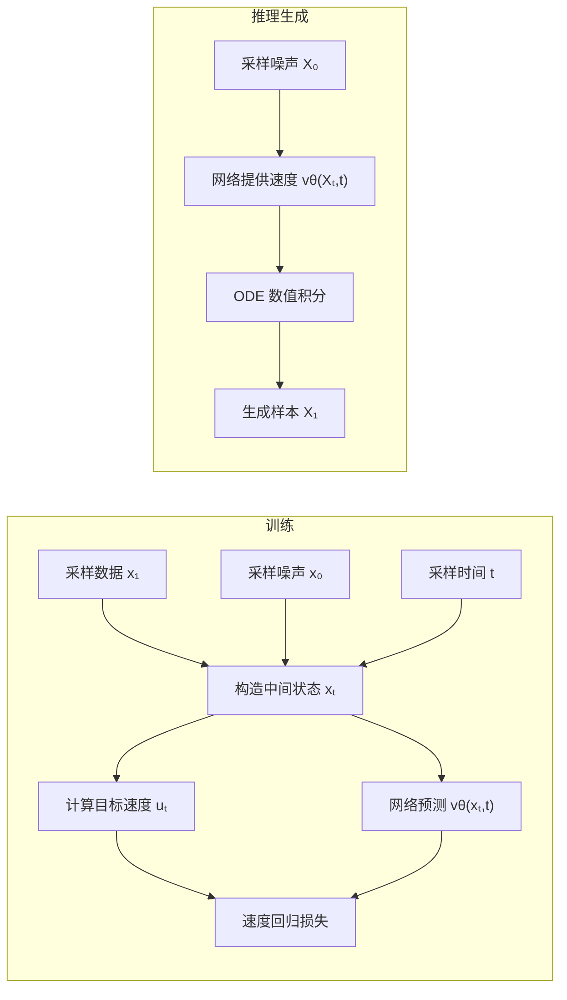

# 从代码角度理解 Flow Matching：训练、推理与 Rectified Flow

可以把 Flow Matching 理解成一个很朴素的工程流程：

> 训练时随机截取一条“运输轨迹”上的一个点，让网络预测该点的运动速度；生成时从噪声出发，反复调用网络提供速度，用 ODE 积分走到数据分布。

本文统一采用以下时间方向：

$$
t=0:\text{噪声},\qquad t=1:\text{数据}.
$$

有些代码库采用相反约定，此时插值方向和目标速度的符号也会相反。

## 一、通用 Flow Matching 模板

### 1. 构建 Flow Matching 需要哪些组件？

一个完整的 Flow Matching 模型通常包含五部分：

1. 初始分布 $p_0$：通常是标准高斯分布；
2. 数据分布 $p_{\mathrm{data}}$：由训练数据集提供；
3. 概率路径：规定噪声和数据之间如何插值；
4. 速度网络 $v_\theta(x,t)$：预测当前位置的运动速度；
5. ODE 求解器：生成时沿学习到的速度场积分。

训练与推理的整体流程如下：



### 2. 选择条件概率路径

首先采样噪声端点和数据端点：

$$
X_0\sim p_0,\qquad X_1\sim p_{\mathrm{data}}.
$$

然后定义插值：

$$
X_t=I_t(X_0,X_1).
$$

一种通用形式是：

$$
X_t=a(t)X_0+b(t)X_1,
$$

其中端点条件为：

$$
a(0)=1,\quad b(0)=0,
$$

$$
a(1)=0,\quad b(1)=1.
$$

这样自然满足：

$$
X_{t=0}=X_0,\qquad X_{t=1}=X_1.
$$

给定一对端点 $Z=(X_0,X_1)$ 后，中间位置是确定的，因此相应的==**条件概率分布**==是：

$$
p_t(x\mid X_0,X_1)
=
\delta\left(x-I_t(X_0,X_1)\right).
$$

### 3. 计算训练监督目标：条件速度

对插值公式关于时间求导：

$$
U_t
=
\frac{\mathrm dX_t}{\mathrm dt}
=
\dot a(t)X_0+\dot b(t)X_1.
$$

$U_t$ 就是训练时使用的目标速度。它能够直接由 $X_0$、$X_1$ 和 $t$ 计算，因此不需要先训练一个教师模型。

如果路径中还包含额外随机变量 $\varepsilon$：

$$
X_t=a(t)X_0+b(t)X_1+\gamma(t)\varepsilon,
$$

那么目标速度相应为：

$$
U_t=\dot a(t)X_0+\dot b(t)X_1+\dot\gamma(t)\varepsilon.
$$

### 4. 网络输入什么？

无条件生成模型通常只输入：

$$
v_\theta(X_t,t),
$$

并输出与 $X_t$ 形状相同的速度向量。

特别重要的是，不能把真实端点 $X_1$ 直接输入无条件生成网络，因为推理时只有初始噪声，并不知道最后应该生成哪个真实样本。

训练过程中：

- 目标速度可以使用 $X_0$ 和 $X_1$ 计算；
- 网络只看到当前位置 $X_t$ 和时间 $t$；
- 网络需要从当前状态推断总体平均应该怎样运动。

如果是文本、类别等条件生成，可以额外输入推理时能够提供的条件 $c$：

$$
v_\theta(X_t,t,c).
$$

### 5. Flow Matching 损失

标准损失是速度回归的均方误差：

$$
\mathcal L_{\mathrm{FM}}
=
\mathbb E
\left[
\left\|
v_\theta(X_t,t)-U_t
\right\|^2
\right].
$$

期望通过随机采样近似：

1. 从数据集中采样一个 minibatch 的 $X_1$；
2. 从初始分布采样 $X_0$；
3. 随机采样时间 $t$；
4. 构造中间状态 $X_t$；
5. 计算目标速度 $U_t$；
6. 让网络回归 $U_t$。

均方误差下的最优网络为：

$$
v^*(x,t)=\mathbb E[U_t\mid X_t=x].
$$

也就是说，虽然单次训练提供的是某一对端点对应的条件速度，但网络最终学到的是边缘向量场：对所有可能产生当前状态的条件轨迹速度进行后验平均。


这里的“最优解”不是说某次训练已经得到了完美网络，而是指：
> 在无限数据、网络表达能力足够、优化完全成功的理想条件下，哪个函数能让总体均方误差最小？

训练损失是

$$ \mathcal L(\theta) = \mathbb E\left[ \left\|v_\theta(X_t,t)-U_t\right\|^2 \right]$$

理论上，在所有可能的预测函数中，使这个期望损失最小的函数是

$$\boxed{ v^*(x,t) = \mathbb E[U_t\mid X_t=x,t] } $$

#### “最优解”为什么不是直接等于 $U_t$？

以 Rectified Flow 为例：
$$X_t=(1-t)X_0+tX_1, \qquad U_t=X_1-X_0$$
单次训练时，我们知道这一对具体端点 \((X_0,X_1)\)，所以可以计算出确定的监督标签：
$$ U_t=X_1-X_0$$
但是网络只输入：
$$v_\theta(X_t,t), $$
它看不到具体的 $X_0,X_1$。而同一个中间位置 $X_t=x$，可能由很多不同的端点对产生：
$$(X_0^{(1)},X_1^{(1)}), \quad (X_0^{(2)},X_1^{(2)}), \quad\ldots $$

这些端点对可能给出不同的速度：
$$ U_t^{(1)},U_t^{(2)},\ldots $$

因此，网络面对的是一个“相同输入可能对应不同监督标签”的回归问题。它不可能同时输出所有速度，只能寻找一个使总体平方误差最小的代表值。

这个代表值就是==**条件平均速度**==。


### 6. 通用 PyTorch 训练代码

```python
import torch
import torch.nn.functional as F


def append_dims(t, x):
    """把 [B] 时间扩展成 [B, 1, 1, ...]，使其能够和 x 广播。"""
    return t.reshape(t.shape[0], *([1] * (x.ndim - 1)))


def path_coefficients(t):
    """示例路径；实际项目中可以替换成其他可微时间函数。"""
    a = 1.0 - t
    b = t

    da = -torch.ones_like(t)
    db = torch.ones_like(t)

    return a, b, da, db


def flow_matching_loss(model, x1):
    batch_size = x1.shape[0]
    device = x1.device

    # 1. 从初始分布采样噪声端点
    x0 = torch.randn_like(x1)

    # 2. 为每个样本独立采样时间
    t = torch.rand(batch_size, device=device)

    # 3. 获取路径系数及其时间导数
    a, b, da, db = path_coefficients(t)

    a = append_dims(a, x1)
    b = append_dims(b, x1)
    da = append_dims(da, x1)
    db = append_dims(db, x1)

    # 4. 构造中间状态
    xt = a * x0 + b * x1

    # 5. 计算条件目标速度
    target_velocity = da * x0 + db * x1

    # 6. 网络预测边缘速度
    predicted_velocity = model(xt, t)

    # 7. 速度回归损失
    return F.mse_loss(predicted_velocity, target_velocity)
```

外层训练循环与普通神经网络基本一致：

```python
model.train()

for epoch in range(num_epochs):
    for x1 in dataloader:
        x1 = x1.to(device)

        optimizer.zero_grad(set_to_none=True)

        loss = flow_matching_loss(model, x1)

        loss.backward()
        optimizer.step()
```

Flow Matching 的一个重要工程特点是：训练时通常不需要从 $t=0$ 完整积分到 $t=1$。每次只随机训练一个中间时刻，因此不需要反向传播穿过完整的 ODE 求解过程。

### 7. 网络结构

网络接口通常为：

```python
velocity = model(x, t)
```

并满足：

```python
velocity.shape == x.shape
```

不同数据类型常用的网络如下：

| 数据类型 | 常用网络 |
|---|---|
| 二维点、低维向量 | MLP |
| 图像 | U-Net、DiT |
| 音频 | 1D U-Net、Transformer |
| 分子、点云 | GNN、等变网络 |
| 潜空间图像 | Latent U-Net、DiT |

时间 $t$ 一般先经过正弦位置编码或 Fourier embedding，再注入网络的各个模块。

### 8. 推理为什么需要 ODE？

训练完成后，模型近似边缘向量场：

$$
\frac{\mathrm dX_t}{\mathrm dt}=v_\theta(X_t,t).
$$

生成时先采样：

$$
X_0\sim\mathcal N(0,I),
$$

然后从 $t=0$ 数值积分到 $t=1$。

最简单的 Euler 方法是：

$$
X_{t+\Delta t}
=
X_t+\Delta t\,v_\theta(X_t,t).
$$

对应代码：

```python
@torch.no_grad()
def sample_euler(model, shape, device, num_steps=100):
    model.eval()

    x = torch.randn(shape, device=device)
    batch_size = shape[0]
    dt = 1.0 / num_steps

    for i in range(num_steps):
        current_t = i / num_steps
        t = torch.full(
            (batch_size,),
            current_t,
            device=device,
        )

        velocity = model(x, t)
        x = x + dt * velocity

    return x
```

### 9. 更准确的 Heun 求解器

Heun 方法每一步调用网络两次，使用起点速度和预测终点速度的平均值：

```python
@torch.no_grad()
def sample_heun(model, shape, device, num_steps=50):
    model.eval()

    x = torch.randn(shape, device=device)
    batch_size = shape[0]
    dt = 1.0 / num_steps

    for i in range(num_steps):
        t_now = i / num_steps
        t_next = (i + 1) / num_steps

        t0 = torch.full((batch_size,), t_now, device=device)
        t1 = torch.full((batch_size,), t_next, device=device)

        # 当前点的速度
        v0 = model(x, t0)

        # 先用 Euler 预测下一位置
        x_predict = x + dt * v0

        # 计算预测终点的速度
        v1 = model(x_predict, t1)

        # 梯形修正
        x = x + 0.5 * dt * (v0 + v1)

    return x
```

实际项目还可以使用 midpoint、Runge–Kutta、自适应步长 ODE solver 或 `torchdiffeq`。

## 二、具体示例：Rectified Flow

### 1. Rectified Flow 的直线路径

最基本的 Rectified Flow 使用直线插值：

$$
\boxed{X_t=(1-t)X_0+tX_1}.
$$

其中：

$$
X_0\sim\mathcal N(0,I),
\qquad
X_1\sim p_{\mathrm{data}}.
$$

对时间求导：

$$
\boxed{U_t=X_1-X_0}.
$$

因此 Rectified Flow 的训练目标为：

$$
\boxed{
\mathcal L_{\mathrm{RF}}
=
\mathbb E
\left[
\left\|
v_\theta((1-t)X_0+tX_1,t)-(X_1-X_0)
\right\|^2
\right]
}.
$$

核心代码只有：

```python
x0 = torch.randn_like(x1)
t = torch.rand(batch_size, device=x1.device)
t_view = append_dims(t, x1)

xt = (1.0 - t_view) * x0 + t_view * x1
target_velocity = x1 - x0

predicted_velocity = model(xt, t)
loss = F.mse_loss(predicted_velocity, target_velocity)
```

### 2. 完整的 Rectified Flow 损失函数

```python
def rectified_flow_loss(model, x1):
    batch_size = x1.shape[0]
    device = x1.device

    # 高斯噪声端点
    x0 = torch.randn_like(x1)

    # 每个样本独立采样时间
    t = torch.rand(batch_size, device=device)
    t_view = append_dims(t, x1)

    # 直线插值
    xt = (1.0 - t_view) * x0 + t_view * x1

    # 每一对固定端点之间的直线速度恒定
    target_velocity = x1 - x0

    # 网络只看到当前状态和时间
    predicted_velocity = model(xt, t)

    return F.mse_loss(
        predicted_velocity,
        target_velocity,
    )
```

训练循环：

```python
model.train()

for epoch in range(num_epochs):
    for x1 in dataloader:
        x1 = x1.to(device)

        optimizer.zero_grad(set_to_none=True)

        loss = rectified_flow_loss(model, x1)

        loss.backward()

        torch.nn.utils.clip_grad_norm_(
            model.parameters(),
            max_norm=1.0,
        )

        optimizer.step()
```

图像项目中一般还会增加：

- 把图像归一化到 $[-1,1]$；
- 维护模型参数的 EMA；
- 使用混合精度训练；
- 使用学习率 warmup；
- 保存 checkpoint；
- 大模型训练时使用分布式训练。

### 3. 为什么网络不能简单记住固定方向？

对于某一对固定端点，目标速度确实恒定：

$$
U_t=X_1-X_0.
$$

但网络没有看到 $X_0$ 和 $X_1$，只看到了 $X_t$ 和 $t$。同一个中间位置 $X_t$ 可能由许多不同的端点对产生，而这些端点对具有不同的目标速度。

因此网络实际学习的是：

$$
v^*(x,t)
=
\mathbb E[X_1-X_0\mid X_t=x].
$$

这就是边缘向量场。

需要特别区分：

> 条件于某一对端点的训练轨迹是直线，但最终由边缘向量场生成的单条 ODE 轨迹不一定是直线。

“训练条件路径是直线”和“模型生成轨迹是直线”不是同一件事。

### 4. Rectified Flow 推理

推理时不再需要真实数据 $X_1$，只需要从高斯分布采样初始噪声，然后使用学习到的速度场积分：

```python
generated = sample_heun(
    model=ema_model,
    shape=(batch_size, channels, height, width),
    device=device,
    num_steps=50,
)
```

完整过程为：

1. 采样高斯噪声 $X_0$；
2. 将当前状态和时间输入速度网络；
3. 得到速度 $v_\theta(X_t,t)$；
4. 用 ODE solver 更新 $X_t$；
5. 重复直到 $t=1$；
6. 将结果反归一化为图像。

例如，模型空间为 $[-1,1]$ 时：

```python
images = generated.clamp(-1, 1)
images = (images + 1.0) / 2.0
```

## 三、训练代码究竟在近似什么？

理论上的边缘概率分布需要对所有端点对积分：

$$
p_t(x)
=
\iint
p_t(x\mid x_0,x_1)
\pi(x_0,x_1)
\,\mathrm dx_0\mathrm dx_1.
$$

代码不会显式计算这个高维积分，而是使用 Monte Carlo 采样：

```python
x1 = next(data_batch)
x0 = torch.randn_like(x1)
t = torch.rand(batch_size)
```

每个 minibatch 只抽取少量数据端点、噪声端点和中间时刻。经过大量训练步骤后，这些随机样本近似理论期望。

理论与代码的对应关系如下：

| 理论对象 | 代码实现 |
|---|---|
| $X_1\sim p_{\mathrm{data}}$ | 从 DataLoader 取样 |
| $X_0\sim p_0$ | `torch.randn_like(x1)` |
| $t\sim U[0,1]$ | `torch.rand(batch_size)` |
| $X_t=(1-t)X_0+tX_1$ | 张量线性插值 |
| $U_t=X_1-X_0$ | 监督标签 |
| $v_\theta(X_t,t)$ | 网络输出 |
| 理论期望 | minibatch 平均损失 |
| 求解流 ODE | Euler、Heun、Runge–Kutta |

## 四、Rectified Flow 中的 Rectified 是什么意思？

基础训练中通常独立采样：

$$
X_0\sim p_0,\qquad X_1\sim p_{\mathrm{data}}.
$$

这种随机配对未必是理想的运输耦合。虽然训练时的条件路径都是直线，但对这些条件速度取后验平均得到的边缘向量场可能比较复杂，从而产生弯曲的生成轨迹。

Rectified Flow 可以进一步执行 reflow：

1. 先训练第一代 Flow Matching 模型；
2. 从噪声 $X_0$ 出发生成 $\hat X_1$；
3. 保存模型产生的配对 $(X_0,\hat X_1)$；
4. 使用这些新配对重新训练直线速度；
5. 得到更直、更适合少步 ODE 求解的流。

第一轮通常使用独立耦合：

$$
X_0\perp X_1.
$$

Reflow 后使用模型诱导的耦合：

$$
(X_0,\hat X_1)\sim\pi_{\mathrm{model}}.
$$

这通常能够减少生成所需的 ODE 积分步数。不过在许多代码和文章中，最基本的直线 Flow Matching 也会直接称为 Rectified Flow。

## 五、代码实现中最容易出错的地方

### 1. 时间方向不一致

若定义噪声在 $t=0$、数据在 $t=1$，目标速度为：

$$
X_1-X_0.
$$

如果定义相反，目标速度应变成：

$$
X_0-X_1.
$$

训练和推理必须使用相同约定。

### 2. 时间张量没有正确广播

图像 $X_t$ 的形状通常是 `[B, C, H, W]`，时间需要从 `[B]` 转换成 `[B, 1, 1, 1]` 后才能逐样本广播。

### 3. 网络输入了推理时不存在的信息

无条件生成网络不能依赖真实 $X_1$。目标速度可以使用 $X_1$ 构造，但网络输入不可以。

### 4. 数据归一化与噪声尺度不匹配

图像通常先归一化到 $[-1,1]$，同时要检查高斯噪声尺度与模型结构是否匹配。

### 5. 混淆条件直线与边缘生成轨迹

条件路径是直线，不意味着学习到的边缘 ODE 轨迹必然是直线。

### 6. ODE 步数过少

模型训练正确不代表一步 Euler 就能准确生成。模型近似误差和 ODE 离散误差是两种不同的误差。

## 六、最小核心总结

Flow Matching 的训练代码可以浓缩为：

```python
# 训练
x1 = data
x0 = torch.randn_like(x1)
t = torch.rand(batch_size)

xt = (1 - t) * x0 + t * x1
target = x1 - x0

loss = mse(model(xt, t), target)
```

生成代码可以浓缩为：

```python
# 推理生成
x = torch.randn(sample_shape)

for t in time_grid:
    x = x + dt * model(x, t)
```

前半段通过“随机中间点的速度回归”学习向量场，后半段通过“反复查询向量场并进行 ODE 积分”把噪声分布运输成数据分布。

## 七、Flow Matching 与 Rectified Flow 的关系

一句话概括：

> Flow Matching 是学习连续流向量场的通用训练框架；Rectified Flow 是其中采用端点直线插值的一种具体构造，并进一步强调通过 reflow 重新耦合端点、拉直生成轨迹。

### 1. Flow Matching 是通用框架

Flow Matching 的目标是训练神经网络 $v_\theta(x,t)$，使其近似选定概率路径对应的边缘向量场。

一般先选择插值：

$$
X_t=I_t(X_0,X_1),
$$

然后计算相应的条件目标速度：

$$
U_t=\frac{\mathrm dI_t(X_0,X_1)}{\mathrm dt}.
$$

训练损失为：

$$
\mathcal L_{\mathrm{FM}}
=
\mathbb E\left[
\left\|v_\theta(X_t,t)-U_t\right\|^2
\right].
$$

插值 $I_t$ 可以采用很多不同的构造，例如：

- 直线插值；
- 非线性插值；
- Gaussian probability path；
- diffusion path；
- optimal transport path；
- 带额外随机扰动的 stochastic interpolant。

因此，Flow Matching 本身并不要求中间路径一定是直线。

### 2. Rectified Flow 是直线路径下的 Flow Matching

基础 Rectified Flow 选择：

$$
\boxed{X_t=(1-t)X_0+tX_1}.
$$

其条件目标速度为：

$$
\boxed{U_t=X_1-X_0}.
$$

因此 Rectified Flow 的训练损失为：

$$
\boxed{
\mathcal L_{\mathrm{RF}}
=
\mathbb E
\left[
\left\|
v_\theta((1-t)X_0+tX_1,t)-(X_1-X_0)
\right\|^2
\right]
}.
$$

这正是通用 Flow Matching 在直线插值下的具体形式。因此从基本训练目标来看：

$$
\boxed{
\text{基础 Rectified Flow}
=
\text{采用直线插值的 Flow Matching}
}.
$$

### 3. 二者在代码中的对应关系

通用 Flow Matching：

```python
xt = interpolate(x0, x1, t)
target_velocity = derivative_of_interpolation(x0, x1, t)

loss = mse(
    model(xt, t),
    target_velocity,
)
```

Rectified Flow：

```python
xt = (1 - t) * x0 + t * x1
target_velocity = x1 - x0

loss = mse(
    model(xt, t),
    target_velocity,
)
```

Rectified Flow 相当于把通用 FM 中的路径函数具体化成直线。

### 4. 为什么条件路径是直线，生成轨迹仍可能弯曲？

对于每一对固定端点 $(X_0,X_1)$，条件路径是直线，速度为常量：

$$
U_t=X_1-X_0.
$$

但是无条件生成网络只看到 $(X_t,t)$，并不知道这次训练样本具体来自哪一对端点。同一个中间状态可能由许多端点对产生，而且这些端点对具有不同的速度。

均方误差下，网络学习的是：

$$
\boxed{
v^*(x,t)
=
\mathbb E[X_1-X_0\mid X_t=x]
}.
$$

这是对条件速度进行后验平均得到的边缘向量场。因此：

> 条件于每一对端点的训练路径是直线，不代表边缘向量场生成的单条 ODE 轨迹也一定是直线。

条件直线可能相互交叉或在同一区域给出不同方向，求平均后形成的边缘速度场仍可能产生弯曲轨迹。

### 5. Rectified 的进一步含义：Reflow

第一次训练时一般独立采样：

$$
X_0\sim p_0,\qquad X_1\sim p_{\mathrm{data}},
\qquad X_0\perp X_1.
$$

这种随机配对未必是理想的运输耦合。基础 Rectified Flow 可以进一步执行 reflow：

1. 先训练第一代 Rectified Flow；
2. 采样初始噪声 $X_0$；
3. 使用第一代模型从 $X_0$ 生成 $\hat X_1$；
4. 保存生成过程诱导的端点配对 $(X_0,\hat X_1)$；
5. 使用这些新端点对再次进行直线 Flow Matching；
6. 得到更直、更适合少步 ODE 求解的流。

第一轮使用的通常是独立耦合，而 reflow 后使用的是模型诱导的耦合：

$$
(X_0,\hat X_1)\sim\pi_{\mathrm{model}}.
$$

Reflow 并没有改变“使用直线插值回归速度”这一基本训练形式，它主要改变了 $X_0$ 与 $X_1$ 的配对方式。更合适的端点耦合可以使学习到的边缘轨迹更直，从而减少推理所需的 ODE 步数。

### 6. 二者的主要区别

| 对比项 | Flow Matching | Rectified Flow |
|---|---|---|
| 定位 | 通用的向量场训练框架 | FM 的一种具体直线路径构造 |
| 概率路径 | 可以自由选择 | 通常采用直线插值 |
| 中间状态 | $X_t=I_t(X_0,X_1)$ | $X_t=(1-t)X_0+tX_1$ |
| 条件目标速度 | $\partial_t I_t$ | $X_1-X_0$ |
| 目标速度是否依赖 $t$ | 不一定 | 对固定端点对不依赖 $t$ |
| 是否强调端点耦合 | 可以涉及，但不是唯一重点 | 比较强调 |
| 是否强调 reflow | 不要求 | 是重要扩展 |
| 推理方式 | 求解神经 ODE | 同样求解神经 ODE |

### 7. 二者训练后都学习边缘向量场

一般 Flow Matching 的最优网络是：

$$
v^*(x,t)=\mathbb E[U_t\mid X_t=x].
$$

Rectified Flow 中 $U_t=X_1-X_0$，所以：

$$
v^*(x,t)
=
\mathbb E[X_1-X_0\mid X_t=x].
$$

二者在推理阶段都求解：

$$
\frac{\mathrm dX_t}{\mathrm dt}=v_\theta(X_t,t),
\qquad X_0\sim p_0,
$$

并从 $t=0$ 积分到 $t=1$。因此，它们在“通过速度回归学习边缘向量场，再通过 ODE 将噪声运输成数据”这一核心机制上完全一致。

### 8. 层级关系与命名差异

可以用下面的层级理解二者：

```text
连续归一化流 / ODE 生成模型
└── Flow Matching：通过速度回归训练向量场
    ├── 非线性概率路径的 Flow Matching
    ├── 扩散概率路径的 Flow Matching
    ├── OT 条件路径的 Flow Matching
    └── 直线插值的 Flow Matching
        └── Rectified Flow
            └── Reflow / 多轮 Rectification
```

不过，不同论文和代码库的命名并不总是严格统一：

- 有些项目只要使用直线插值就称为 Rectified Flow；
- 有些语境更强调重新耦合端点和 reflow；
- 直线 Flow Matching、直线路径 Conditional Flow Matching 和基础 Rectified Flow 的训练损失可能完全相同。

实际阅读代码时，最直接的判断依据是：

```python
xt = (1 - t) * noise + t * data
target = data - noise
```

如果核心训练逻辑是这两行，那么它在数学上可以称为直线 Flow Matching、Conditional Flow Matching 的直线路径版本，也可以称为基础 Rectified Flow。

## 八、从条件概率路径到实际训练目标：边缘向量场是否需要显式计算？

对于 Flow Matching，可以先建立如下总体认识：

> 条件概率路径通常是人为选择的；条件向量场可以由随机插值求导或通过连续性方程刻画；但实际训练通常不会先显式计算边缘向量场，而是直接用容易计算的条件速度监督网络，让网络通过均方误差回归隐式学到边缘向量场。

因此，实际流程是：

$$
\boxed{
\text{设计条件路径}
\rightarrow
\text{得到条件向量场}
\rightarrow
\text{用条件向量场训练}
\rightarrow
\text{网络隐式学到边缘向量场}
}
$$

而不是必须先把边缘向量场显式积分出来，再将其作为训练标签。

### 1. 条件概率路径是人为选择的，但不是随意选择的

首先选择条件变量 $Z$。例如，可以令：

$$
Z=(X_0,X_1),
$$

并人为规定随机插值：

$$
X_t=I_t(X_0,X_1).
$$

Rectified Flow 使用：

$$
X_t=(1-t)X_0+tX_1.
$$

路径虽然是人为设计的，但一般需要满足：

- $t=0$ 时对应初始分布；
- $t=1$ 时对应数据分布；
- 中间状态容易采样；
- 条件速度容易计算；
- 路径足够平滑；
- 对应 ODE 具有较好的数值稳定性。

因此更准确的说法是：条件路径是一个受到端点约束、可计算性和数值性质约束的设计选择。

### 2. 获得条件向量场的两种视角

“对插值求导”和“使用连续性方程”不是通常必须依次执行的两个计算步骤，而是获得或刻画条件向量场的两种视角。

#### 2.1 对随机插值求导

如果直接定义了粒子插值：

$$
X_t=I_t(Z),
$$

则可以对时间求导：

$$
U_t
=
\frac{\mathrm dX_t}{\mathrm dt}
=
\partial_t I_t(Z).
$$

例如 Rectified Flow 中：

$$
X_t=(1-t)X_0+tX_1,
$$

所以：

$$
U_t=X_1-X_0.
$$

这是实际写代码时最常用的方法，因为中间状态和目标速度都可以直接采样或计算。

#### 2.2 通过连续性方程寻找兼容的向量场

如果首先给定的是条件概率密度路径：

$$
p_t(x\mid z),
$$

则需要寻找满足条件连续性方程的向量场：

$$
\partial_t p_t(x\mid z)
+
\nabla\cdot
\left[
p_t(x\mid z)u_t(x\mid z)
\right]
=0.
$$

但是，连续性方程一般不会自动给出唯一的条件向量场，原因包括：

- 在高维空间中直接求解可能很困难；
- 同一条概率密度路径可能由多个向量场生成；
- 可能需要加入最小动能、梯度场或最优传输等额外约束才能选出特殊解。

因此工程实践通常先选择容易求导的随机插值，再用连续性方程从理论上说明该速度确实推动了相应的概率路径。

### 3. 理论上的边缘概率路径和边缘向量场

将条件变量边缘化，得到：

$$
p_t(x)
=
\int p_t(x\mid z)q(z)\,\mathrm dz.
$$

相应的边缘向量场为：

$$
\boxed{
v_t(x)
=
\mathbb E
\left[
u_t(x\mid Z)\mid X_t=x
\right]
}.
$$

展开后为：

$$
v_t(x)
=
\frac{
\int
u_t(x\mid z)p_t(x\mid z)q(z)
\,\mathrm dz
}{
p_t(x)
}.
$$

这表明边缘向量场是条件向量场在已知当前状态后的后验平均，而不是按照条件先验 $q(z)$ 进行简单平均。

如果边缘向量场可以显式获得，就可以直接构造理想的 Flow Matching 损失：

$$
\mathcal L_{\mathrm{FM}}
=
\mathbb E_{t,X_t\sim p_t}
\left[
\left\|v_\theta(X_t,t)-v_t(X_t)\right\|^2
\right].
$$

但在真实高维数据中，这通常要求对整个数据分布积分并计算后验 $p_t(z\mid x)$，因而难以显式实现。

### 4. 实际训练使用条件向量场作为监督

为了避开难以计算的边缘向量场，实际训练通常采用 Conditional Flow Matching 损失：

$$
\boxed{
\mathcal L_{\mathrm{CFM}}
=
\mathbb E_{Z,X_t}
\left[
\left\|
v_\theta(X_t,t)-u_t(X_t\mid Z)
\right\|^2
\right]
}.
$$

训练过程只需要：

1. 采样条件变量 $Z$；
2. 采样或构造中间状态 $X_t$；
3. 计算条件目标速度；
4. 使用该速度监督神经网络。

抽象代码如下：

```python
z = sample_condition()
t = sample_time()

xt, conditional_velocity = sample_conditional_path(z, t)

predicted_velocity = model(xt, t)
loss = mse(predicted_velocity, conditional_velocity)
```

这里没有显式计算边缘向量场 $v_t(x)$。

### 5. 为什么条件速度回归能学到边缘速度？

令随机训练目标为：

$$
U=u_t(X_t\mid Z).
$$

网络只能看到 $(X_t,t)$，看不到用于构造监督目标的完整条件变量 $Z$。对于均方误差，所有只依赖当前状态的预测函数中，最优函数是条件期望：

$$
v^*(x,t)
=
\mathbb E[U\mid X_t=x].
$$

而这恰好就是边缘向量场：

$$
\boxed{
v^*(x,t)
=
\mathbb E
\left[
u_t(x\mid Z)\mid X_t=x
\right]
=
v_t(x)
}.
$$

因此，边缘向量场不是必须在训练前显式计算出来的对象，而是网络在观察大量条件速度训练样本后学到的回归函数。

### 6. FM Loss 与 CFM Loss 的关系

将随机条件速度写成：

$$
U_t
=
v_t(X_t)
+
\left[U_t-v_t(X_t)\right].
$$

利用条件期望的正交性质，可以得到平方误差分解：

$$
\mathbb E\left\|v_\theta-U_t\right\|^2
=
\mathbb E\left\|v_\theta-v_t\right\|^2
+
\mathbb E\left\|U_t-v_t\right\|^2.
$$

第二项不依赖模型参数 $\theta$，因此：

$$
\boxed{
\mathcal L_{\mathrm{CFM}}
=
\mathcal L_{\mathrm{FM}}
+
\text{与 }\theta\text{ 无关的项}
}.
$$

所以两种损失具有相同的：

- 最优向量场；
- 关于模型参数的梯度；
- 训练目标。

CFM 的关键价值就是用容易采样和计算的条件速度，替代难以显式计算的边缘速度作为监督。

### 7. Rectified Flow 中的具体对应

采样：

$$
X_0\sim\mathcal N(0,I),
\qquad
X_1\sim p_{\mathrm{data}},
\qquad
t\sim U[0,1].
$$

设计直线路径：

$$
X_t=(1-t)X_0+tX_1.
$$

条件目标速度为：

$$
U_t=X_1-X_0.
$$

实际训练代码为：

```python
x1 = next(data_batch)
x0 = torch.randn_like(x1)
t = torch.rand(batch_size, device=x1.device)
t_view = append_dims(t, x1)

xt = (1.0 - t_view) * x0 + t_view * x1
conditional_velocity = x1 - x0

predicted_velocity = model(xt, t)
loss = mse(predicted_velocity, conditional_velocity)
```

理论上的边缘向量场为：

$$
v_t(x)
=
\mathbb E[X_1-X_0\mid X_t=x].
$$

代码不会直接计算这个高维条件期望，而是通过大量 minibatch 的条件速度回归，让网络自动逼近它。

### 8. 最终的完整流程

可以将 Flow Matching 的理论与实际流程统一整理为：

```text
1. 选择初始分布、数据分布和端点耦合
                     ↓
2. 人为设计条件概率路径或随机插值
                     ↓
3. 对插值求导，得到容易计算的条件速度
                     ↓
4. 理论上：条件路径混合形成边缘概率路径
                     ↓
5. 理论上：条件速度的后验平均形成边缘向量场
                     ↓
6. 实际上：不显式计算这个边缘向量场
                     ↓
7. 直接用条件速度构造 CFM Loss 训练网络
                     ↓
8. 训练后的网络近似边缘向量场
                     ↓
9. 推理时使用网络向量场求解 ODE
```

最需要记住的修正是：

> 不是“先算出边缘向量场，再用它训练网络”，而是“使用可计算的条件向量场训练网络，让网络隐式学习难以直接计算的边缘向量场”。

## 九、MSE 最优解、后验概率与边缘向量场：关键理论闭环

Conditional Flow Matching 中最关键的等式是：

$$
\boxed{
v^*(x,t)
=
\mathbb E[U_t\mid X_t=x,t]
=
v_t(x)
}
$$

它将三个看似不同的对象联系起来：

1. 神经网络在均方误差下的理想最优输出；
2. 条件速度在给定当前位置后的后验平均；
3. 生成边缘概率路径所需要的边缘向量场。

### 1. “最优网络”是什么意思？

训练损失为：

$$
\mathcal L(\theta)
=
\mathbb E
\left[
\left\|v_\theta(X_t,t)-U_t\right\|^2
\right].
$$

这里的“最优解”是函数空间中的理想结论：假设有无限训练数据、网络表达能力足够强，并且优化能够完全成功，在所有可能的预测函数中，哪个函数能让总体期望损失最小？

答案是：

$$
v^*(x,t)
=
\mathbb E[U_t\mid X_t=x,t].
$$

实际训练得到的参数网络一般只是近似这个理想函数：

$$
v_{\theta_{\mathrm{trained}}}(x,t)
\approx
v^*(x,t).
$$

二者之间可能存在有限数据、网络容量、优化误差和数值误差造成的差距。

### 2. 为什么网络不能直接输出单次训练的条件速度？

以 Rectified Flow 为例：

$$
X_t=(1-t)X_0+tX_1,
\qquad
U_t=X_1-X_0.
$$

单次训练时，代码知道具体端点 $(X_0,X_1)$，因此可以准确计算监督标签 $U_t$。但无条件生成网络只输入：

$$
(X_t,t),
$$

并不知道这次样本来自哪一对端点。

同一个中间位置 $X_t=x$ 可能由许多不同的端点对产生，而这些端点对会提供不同的条件速度。网络不可能对同一个输入同时输出所有标签，只能选择一个使总体平方误差最小的代表速度。

### 3. 为什么 MSE 的最优输出是条件期望？

固定当前位置和时间 $(x,t)$，假设网络在这里输出向量 $a$。对应的条件风险是：

$$
R(a\mid x,t)
=
\mathbb E
\left[
\|a-U_t\|^2
\mid X_t=x,t
\right].
$$

定义条件平均速度：

$$
m(x,t)
=
\mathbb E[U_t\mid X_t=x,t].
$$

平方误差可以分解为：

$$
\boxed{
R(a\mid x,t)
=
\|a-m(x,t)\|^2
+
\mathbb E
\left[
\|U_t-m(x,t)\|^2
\mid X_t=x,t
\right]
}
$$

第二项是条件速度本身的不确定性，不受预测值 $a$ 影响。网络唯一能够减小的是第一项，因此最优输出为：

$$
\boxed{
a^*=m(x,t)
=
\mathbb E[U_t\mid X_t=x,t]
}.
$$

例如，在某个 $(x,t)$ 处，目标速度以 $0.75$ 的概率为 $+2$，以 $0.25$ 的概率为 $-2$，那么 MSE 最优输出为：

$$
0.75\times2+0.25\times(-2)=1.
$$

MSE 不会随机选择一条轨迹，也不会简单选择出现次数最多的速度，而是输出条件平均速度。

### 4. 什么是后验概率？

设潜在条件变量为 $Z$，例如：

$$
Z=(X_0,X_1).
$$

在观察当前位置之前，$Z$ 的分布为：

$$
q(z),
$$

它叫作**先验分布**，表示不同条件在全局上原本有多常见。

固定 $Z=z$ 后，在时刻 $t$ 观察到 $X_t=x$ 的条件密度为：

$$
p_t(x\mid z),
$$

当它被视为 $z$ 的函数时，称为**似然**，表示条件 $z$ 对当前位置 $x$ 的解释能力。

已经观察到 $X_t=x$ 后，反过来推断潜在条件 $Z$ 的分布：

$$
\boxed{
p_t(z\mid x)
=
\frac{p_t(x\mid z)q(z)}{p_t(x)}
}
$$

称为**后验分布**，其中：

$$
p_t(x)
=
\int p_t(x\mid z)q(z)\,\mathrm dz
$$

是证据或边缘似然，用于归一化。

贝叶斯公式可以记为：

$$
\boxed{
\text{后验}
=
\frac{\text{似然}\times\text{先验}}
{\text{证据}}
}
$$

在 Flow Matching 中，$p_t(z\mid x)$ 的含义是：

> 已知粒子当前位于 $x$，它来自不同条件轨迹 $z$ 的可能性分别有多大？

因此，后验概率也可以理解成当前位置处不同条件轨迹的局部占比。

### 5. 为什么不能按照先验简单平均条件速度？

假设只有两类条件轨迹 $A$ 和 $B$，先验相同：

$$
q(A)=q(B)=0.5.
$$

但在当前位置 $x$，两条路径的似然为：

$$
p_t(x\mid A)=0.8,
\qquad
p_t(x\mid B)=0.2.
$$

未归一化的后验权重分别为：

$$
0.8\times0.5=0.4,
\qquad
0.2\times0.5=0.1.
$$

归一化后：

$$
p_t(A\mid x)=0.8,
\qquad
p_t(B\mid x)=0.2.
$$

若两种条件速度为：

$$
u_t(x\mid A)=+2,
\qquad
u_t(x\mid B)=-2,
$$

那么按照先验简单平均会得到零，但正确的局部平均速度是：

$$
v_t(x)
=
0.8\times2+0.2\times(-2)
=
1.2.
$$

原因是虽然两类条件在全局上各占一半，但当前位置的概率质量中有 $80\%$ 来自 $A$。边缘速度必须按照当前位置的局部占比，也就是后验概率进行加权。

### 6. 从概率流严格推出边缘向量场

每个条件概率路径满足：

$$
\partial_t p_t(x\mid z)
+
\nabla\cdot
\left[
p_t(x\mid z)u_t(x\mid z)
\right]
=0.
$$

其中：

$$
J_t(x\mid z)
=
p_t(x\mid z)u_t(x\mid z)
$$

是条件概率流，可以类比为：

$$
\text{流量}=\text{密度}\times\text{速度}.
$$

把所有条件按先验 $q(z)$ 混合，总概率密度为：

$$
p_t(x)
=
\int p_t(x\mid z)q(z)\,\mathrm dz,
$$

总概率流为：

$$
J_t(x)
=
\int
p_t(x\mid z)u_t(x\mid z)q(z)
\,\mathrm dz.
$$

如果使用一个边缘速度 $v_t(x)$ 表示总概率流，它必须满足：

$$
J_t(x)=p_t(x)v_t(x).
$$

因此：

$$
\begin{aligned}
v_t(x)
&=
\frac{
\int p_t(x\mid z)u_t(x\mid z)q(z)\,\mathrm dz
}{p_t(x)}\\
&=
\int
u_t(x\mid z)
\frac{p_t(x\mid z)q(z)}{p_t(x)}
\,\mathrm dz\\
&=
\int
u_t(x\mid z)p_t(z\mid x)
\,\mathrm dz.
\end{aligned}
$$

所以：

$$
\boxed{
v_t(x)
=
\mathbb E
\left[
u_t(x\mid Z)\mid X_t=x
\right]
}
$$

这不是人为额外规定的平均公式，而是由“总概率流等于所有条件概率流之和”自然推出的。

将条件连续性方程乘以 $q(z)$ 并积分，还可以得到：

$$
\partial_t p_t(x)
+
\nabla\cdot
\left[p_t(x)v_t(x)\right]
=0.
$$

因此这个后验平均速度确实是推动边缘概率路径 $p_t(x)$ 的向量场。

### 7. 在 Rectified Flow 中的具体含义

Rectified Flow 中：

$$
X_t=(1-t)X_0+tX_1,
\qquad
U_t=X_1-X_0.
$$

观察到当前位置 $X_t=x$ 后，后验分布：

$$
p_t(X_0,X_1\mid X_t=x)
$$

描述哪些噪声—数据端点对可能产生当前位置，以及各自的相对可能性。

所以边缘向量场为：

$$
\boxed{
v_t(x)
=
\mathbb E
\left[
X_1-X_0\mid X_t=x
\right]
}
$$

即对所有可能经过当前位置的条件直线速度进行后验加权平均。

这也解释了为什么条件轨迹都是直线，但边缘 ODE 轨迹仍可能弯曲：不同直线在同一区域给出不同速度，后验平均后的速度会随位置和时间变化。

### 8. 不可约误差与 Reflow 的意义

即使网络完美学到了边缘向量场，CFM Loss 也不一定下降到零，因为还存在：

$$
\mathbb E
\left[
\|U_t-v_t(X_t)\|^2
\right].
$$

它表示在给定同一个 $(X_t,t)$ 时，不同条件轨迹仍可能给出不同速度。这是条件速度本身的不可约方差，不一定意味着模型训练失败。

端点耦合越混乱、条件轨迹交叉越严重，这种速度冲突通常越明显。Rectified Flow 的 reflow 通过改善端点配对，使相同区域内的条件速度更加一致，从而有机会降低目标方差、拉直边缘轨迹，并减少推理所需的 ODE 步数。

### 9. 最关键的闭环

可以将这部分总结为：

```text
条件路径提供容易计算的条件速度 Uₜ
                    ↓
网络只观察当前状态 (Xₜ,t)
                    ↓
MSE 的理想最优输出是 E[Uₜ | Xₜ=x,t]
                    ↓
该条件期望就是按后验概率加权的局部平均速度
                    ↓
概率流推导证明这个局部平均速度就是边缘向量场 vₜ(x)
                    ↓
网络因此能够在不显式计算 vₜ(x) 的情况下学习它
                    ↓
推理时使用网络近似的边缘向量场求解 ODE
```

最简洁的记忆方式是：

> 先验说明不同条件在全局上有多常见；后验说明已经来到当前位置后，各条条件轨迹在这里分别占多大比例；边缘向量场就是按照这些局部占比，对条件速度进行加权平均。MSE 恰好会自动学出这个平均。
