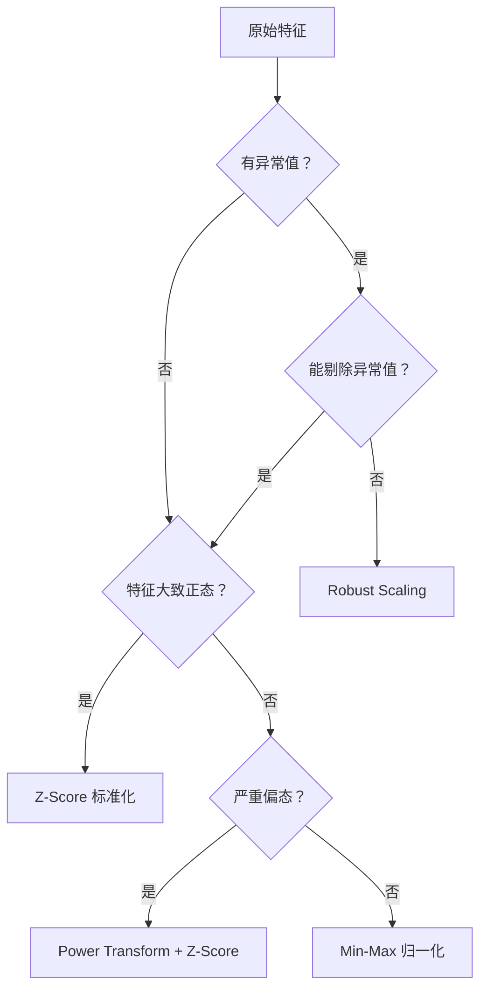

---
tags:
  - Deep-Learning
  - normalization
related:
  - "[[深度学习基础知识点]]"
---

# 归一化与标准化

归一化和标准化是深度学习中无处不在的技术。它们分布在两个层面：

1. **数据预处理**：训练前对输入数据进行缩放变换
2. **网络结构**：插入网络内部的归一化层，稳定训练

---

## 一、概念辨析

> 中文语境下经常混用，先厘清定义。

| 术语 | 英文 | 本质 | 典型公式 |
|------|------|------|----------|
| **归一化** | Normalization | 将数据映射到 $[0, 1]$ 或 $[-1, 1]$ | $x' = \frac{x - x_{\min}}{x_{\max} - x_{\min}}$ |
| **标准化** | Standardization | 将数据变换为均值为 0、标准差为 1 的分布 | $x' = \frac{x - \mu}{\sigma}$ |
| **正则化** | Regularization | 对模型参数施加惩罚，防止过拟合 | $L = L_0 + \lambda \|\mathbf{w}\|$ |

> **关键区分**：Normalization（归一化/标准化）操作的是**数据**；Regularization（正则化）操作的是**模型参数/损失函数**。中文常把两者都叫"归一化"，但本质完全不同。

---

## 二、数据预处理中的缩放方法

### 2.1 Min-Max 归一化

将数据线性映射到 $[0, 1]$（或任意区间 $[a, b]$）：

$$
x' = \frac{x - x_{\min}}{x_{\max} - x_{\min}}
$$

或映射到 $[a, b]$：

$$
x' = a + \frac{(x - x_{\min})(b - a)}{x_{\max} - x_{\min}}
$$

**特点**：
- ✅ 保留原始分布形状（线性变换）
- ✅ 将不同量纲的特征拉到同一尺度
- ❌ 对异常值极度敏感 —— 一个 outlier 会压缩所有正常值

**适用场景**：图像像素（0-255 → 0-1）、需要严格有界输出的情况、某些需要概率输出的模型

### 2.2 Z-Score 标准化（Standardization）

将数据变换为均值为 0、标准差为 1 的分布：

$$
x' = \frac{x - \mu}{\sigma}
$$

**特点**：
- ✅ 对异常值比 Min-Max 鲁棒（不依赖 min/max）
- ✅ 结果均值为 0、标准差为 1，利于梯度下降
- ❌ 不保证输出在特定区间内
- 假设数据近似正态分布时效果最佳

**适用场景**：**最常用**。线性回归、逻辑回归、SVM、PCA、绝大多数神经网络输入

### 2.3 MaxAbs 缩放

将数据除以最大绝对值，映射到 $[-1, 1]$：

$$
x' = \frac{x}{|x|_{\max}}
$$

**特点**：
- ✅ 保留零值（稀疏数据中大量 0 不动）
- ✅ 不破坏数据稀疏性
- ❌ 对异常值敏感

**适用场景**：稀疏数据（如 TF-IDF 特征）、已经零中心化的数据

### 2.4 Robust Scaling（鲁棒缩放）

用**中位数和四分位距**替代均值和标准差：

$$
x' = \frac{x - \text{median}(x)}{\text{IQR}(x)}, \quad \text{IQR} = Q_3 - Q_1
$$

**特点**：
- ✅ **对异常值高度鲁棒** —— median 和 IQR 不受 outlier 影响
- ❌ 不保证均值为 0 或单位方差

**适用场景**：数据中**异常值多**且无法剔除时（如金融交易数据）

### 2.5 幂变换（Power Transformation）

将偏态分布拉向正态分布，再标准化：

**Box-Cox**（要求数据 > 0）：

$$
x' = \begin{cases}
\frac{x^\lambda - 1}{\lambda}, & \lambda \neq 0 \\
\ln x, & \lambda = 0
\end{cases}
$$

**Yeo-Johnson**（允许负值和零，Box-Cox 的推广）：

$$x' = \begin{cases}
\frac{(x+1)^\lambda - 1}{\lambda}, & x \geq 0, \lambda \neq 0 \\
\ln(x+1), & x \geq 0, \lambda = 0 \\
-\frac{(-x+1)^{2-\lambda} - 1}{2-\lambda}, & x < 0, \lambda \neq 2 \\
-\ln(-x+1), & x < 0, \lambda = 2
\end{cases}$$

**特点**：
- ✅ 将偏态/重尾分布拉近正态，很多模型（如线性回归）假设特征接近正态
- ❌ 计算开销较大（需要拟合 $\lambda$）
- $\lambda$ 通常通过极大似然估计自动选取

**适用场景**：特征严重偏态时（收入、人口、点击量等长尾分布）

### 2.6 分位数变换（Quantile Transformation）

将数据映射到均匀分布 $[0,1]$ 或正态分布 $\mathcal{N}(0,1)$：

- 用 CDF 的逆函数将 rank 映射到目标分布
- **完全非线性**，强行拉平分布形状

**特点**：
- ✅ 将任意分布强行变成均匀/正态
- ✅ 完全消除异常值的影响（把它们压到分布两端）
- ❌ 扭曲特征间的线性关系
- ❌ 需要足够多样本来估计分位数

**适用场景**：非参数方法、特征分布极度不规则、希望强制正态/均匀时

### 2.7 各方法对比

| 方法 | 输出范围 | 受异常值影响 | 保留分布形状 | 保留稀疏性 |
|------|----------|:---:|:---:|:---:|
| Min-Max | $[0,1]$ | ❌ 严重 | ✅ | ❌ |
| Z-Score | 无界 | ⚠️ 中等 | ✅ | ❌ |
| MaxAbs | $[-1,1]$ | ❌ 严重 | ✅ | ✅ |
| Robust | 无界 | ✅ 极小 | ✅ | ❌ |
| Power | 无界 | ⚠️ 中等 | ❌（改变形状） | ❌ |
| Quantile | $[0,1]$ 或 $\mathcal{N}$ | ✅ 极小 | ❌（完全改变） | ❌ |

---

## 三、网络内部的归一化层

在网络中间层插入归一化，是现代深度网络的标配。**核心动机**：缓解 **Internal Covariate Shift**（内部协变量偏移）—— 每层输入的分布在训练过程中持续变化，迫使后续层不断适应。

### 3.1 统一框架

所有现代归一化层的计算步骤相同：

1. **计算统计量**（均值 $\mu$、方差 $\sigma^2$）—— **各方法的区别只在这一步**
2. **归一化**：$\hat{x} = \frac{x - \mu}{\sqrt{\sigma^2 + \epsilon}}$
3. **仿射变换（可选可学）**：$y = \gamma \hat{x} + \beta$

> 第 3 步的 $\gamma$ 和 $\beta$ 是**可学习参数**，让网络有能力恢复归一化前的表达能力。否则强制零均值单位方差会限制网络容量。

### 3.2 Batch Normalization（BN，批归一化）

**Paper**：Ioffe & Szegedy, 2015

在 **batch 维度**上计算均值和方差：

$$
\mu_B = \frac{1}{N \cdot H \cdot W} \sum_{n,h,w} x_{nchw}
$$

- 对 CNN：$x \in \mathbb{R}^{N \times C \times H \times W}$，沿 $(N, H, W)$ 轴求统计量
- 每个通道独立计算一对 $(\mu_c, \sigma_c)$
- 训练时用 mini-batch 统计量；推理时用训练集的**滑动平均**

**核心特性**：
- ✅ 允许使用更大的学习率，加速收敛
- ✅ 减轻对初始化的敏感性
- ✅ 自带轻微正则化效果（batch 统计量的噪声 ≈ 噪声注入）
- ❌ **对 batch size 敏感** —— batch 太小（< 4）时统计量不稳定
- ❌ 不适用于 RNN（时序维度上 batch 统计量无意义）
- ❌ 训练和推理行为不一致（需要维护 running mean/var）

$$
\text{BN}(x_i) = \gamma \cdot \frac{x_i - \mu_B}{\sqrt{\sigma_B^2 + \epsilon}} + \beta
$$

### 3.3 Layer Normalization（LN，层归一化）

**Paper**：Ba et al., 2016

在 **特征维度**上计算均值和方差：

$$
\mu_n = \frac{1}{C \cdot H \cdot W} \sum_{c,h,w} x_{nchw}
$$

- 对 CNN：沿 $(C, H, W)$ 轴，每个样本独立计算
- **每个样本自身计算一组统计量**

**核心特性**：
- ✅ **不依赖 batch size** —— batch = 1 也正常工作
- ✅ 适用于 RNN / Transformer（每个 token 独立归一化）
- ✅ 训练和推理行为一致
- ❌ CNN 中效果通常不如 BN（丢失了通道间的相对关系）
- ❌ 对深层 CNN 可能不稳定

**Transformer 中的 LayerNorm** 是使其成功的核心组件之一！

$$
\text{LN}(x) = \gamma \odot \frac{x - \mu}{\sqrt{\sigma^2 + \epsilon}} + \beta
$$

其中 $\mu, \sigma^2$ 沿最后一个维度（hidden dim）计算。

**两种放置策略**：

| 策略 | 顺序 | 使用模型 |
|------|------|----------|
| **Post-LN** | Attention/FFN → LN → Residual Add | 原始 Transformer, BERT |
| **Pre-LN** | LN → Attention/FFN → Residual Add | GPT-2/3, ViT, 大多数现代 Transformer |

> Pre-LN 训练更稳定，不需要 warmup。现代大模型几乎都用 Pre-LN。

### 3.4 Instance Normalization（IN，实例归一化）

**Paper**：Ulyanov et al., 2016

在 **空间维度**上，每个样本每个通道独立计算：


$$
\mu_{nc} = \frac{1}{H \cdot W} \sum_{h,w} x_{nchw}
$$

**核心特性**：
- ✅ 完全独立于 batch 和通道
- ✅ **移除单个样本的对比度信息**，保留内容结构
- ❌ 用于分类任务会丢失判别性信息

**适用场景**：**风格迁移**（AdaIN、StyleGAN）、图像生成 —— 实例归一化"洗掉"对比度的特性恰好是风格解耦所需。

### 3.5 Group Normalization（GN，组归一化）

**Paper**：Wu & He, 2018

介于 LN 和 IN 之间：将通道分组，在每组内做归一化。

设 $G$ 为组数，每组有 $C/G$ 个通道。在每组内的 $(C_g, H, W)$ 维度上计算：

$$
\mu_{ng} = \frac{1}{(C/G) \cdot H \cdot W} \sum_{c \in \text{group}_g, h,w} x_{nchw}
$$

**核心特性**：
- ✅ **不依赖 batch size** —— batch = 2 也稳定
- ✅ 分类和检测任务中表现好
- ✅ $G=1$ 退化为 LN，$G=C$ 退化为 IN
- ⚠️ 需要调参：组数 $G$（通常设 $G=32$）

**适用场景**：**检测/分割任务**的 backbone（Mask R-CNN、Detectron2 默认用 GN），batch size 受限时（如显存不足做不了大 batch）

### 3.6 四种归一化对比（4D 张量视角）

输入张量 $[N, C, H, W]$：

| 方法 | 计算统计量的轴 | 统计量形状 | 依赖 Batch |
|------|--------------|------------|:---:|
| **BN** | $N, H, W$ | $[C]$ | ✅ 是 |
| **LN** | $C, H, W$ | $[N]$ | ❌ 否 |
| **IN** | $H, W$ | $[N, C]$ | ❌ 否 |
| **GN** | $C/G, H, W$ | $[N, G]$ | ❌ 否 |

可视化总结：

```
Batch Norm:    [N, ☒, H, W]   沿 N/H/W  → 每个通道一对统计量
Layer Norm:    [☒, C, H, W]   沿 C/H/W  → 每个样本一对统计量
Instance Norm: [N, C, ☒, ☒]   沿 H/W    → 每个样本每个通道一对统计量
Group Norm:    [N, ☒/G, ☒, ☒]  分组后沿 C/G 和 H/W → 每个样本每组一对统计量
```

### 3.7 RMSNorm（Root Mean Square Layer Normalization）

**Paper**：Zhang & Sennrich, 2019

LayerNorm 的简化版：**只缩放，不移位**（不减去均值）：

$$
\text{RMSNorm}(x) = \frac{x}{\text{RMS}(x)} \cdot \gamma, \quad \text{RMS}(x) = \sqrt{\frac{1}{d}\sum_{i=1}^{d}x_i^2}
$$

**核心特性**：
- ✅ 计算比 LN 快约 **7-15%**（少一次减法、少一次均值计算）
- ✅ 实验表明**效果与 LN 持平甚至略好**
- 为什么去掉均值无害？有论文认为 LN 的成功主要来自**缩放不变性**（scale invariance），而非平移不变性

**适用场景**：LLaMA, LLaMA 2, Mistral, Qwen 等几乎所有现代 LLM 都使用 RMSNorm

### 3.8 Weight Normalization（WN，权重归一化）

**Paper**：Salimans & Kingma, 2016

不归一化激活值，而是**重参数化权重**：

$$
\mathbf{w} = g \cdot \frac{\mathbf{v}}{\|\mathbf{v}\|}
$$

- $\mathbf{v}$：方向向量（可学习）
- $g$：标量缩放因子（可学习）

**核心特性**：
- ✅ 解耦了权重的**方向**和**长度**，利于优化
- ✅ 计算开销极小
- ❌ 对深度网络的训练稳定性不如 BN

**适用场景**：RNN、强化学习、GAN（某些情况下）

### 3.9 Local Response Normalization（LRN，局部响应归一化）

**早期技术**，AlexNet 中使用。在相邻通道间做**横向抑制**（lateral inhibition）：

$$
b^i_{x,y} = a^i_{x,y} \left( k + \alpha \sum_{j=\max(0, i-n/2)}^{\min(C-1, i+n/2)} (a^j_{x,y})^2 \right)^{-\beta}
$$

- 模拟神经生物学中的**侧抑制**：强激活的神经元抑制邻近神经元
- 已被 BN 取代，现代网络中几乎不再使用

---

## 四、选择指南

### 4.1 数据预处理选择



- **不确定用什么时**：先 Z-Score，这是最安全的默认选择
- **图像数据**：像素值 / 255 做 Min-Max，或直接用 ImageNet 的 mean/std 做 Z-Score
- **文本/Embedding**：一般不需要预处理，或直接用 LayerNorm
- **有异常值且不能丢**：Robust Scaling

### 4.2 网络层选择

| 任务 | 推荐 | 原因 |
|------|------|------|
| **图像分类（CNN）** | BN | 经典有效，batch size 够大时首选 |
| **图像分类（小 batch）** | GN | batch < 4 时替代 BN |
| **目标检测 / 分割** | GN 或 BN (SyncBN) | batch 受限于显存 |
| **图像生成 / 风格迁移** | IN | 移除实例级对比度信息 |
| **NLP（Transformer）** | Pre-LN 或 RMSNorm | 现代 LLM 标配 |
| **RNN / LSTM** | LN | 不依赖 batch |
| **GAN** | IN（生成器）/ LN（判别器） | 不同部分需求不同 |

---

## 五、常见问题

### Q1: BN 的 $\epsilon$ 是干什么的？

防止除以零（当方差极小时）。默认值通常为 $10^{-5}$（PyTorch）或 $10^{-3}$（TensorFlow）。

### Q2: 为什么 BN 要做仿射变换（$\gamma, \beta$）？

如果强制将每层输出变为零均值单位方差，会限制网络的表达能力。例如 Sigmoid 激活函数需要输入在特定区间才能有效传递梯度。$\gamma, \beta$ 让网络自己学回最优的均值和方差。

### Q3: BN 在训练和推理时的行为有什么不同？

| 阶段 | 均值/方差来源 |
|------|-------------|
| **训练** | 当前 mini-batch 的统计量 |
| **推理** | 训练时滑动平均累积的全局统计量 |

这种不一致是 BN 的一个麻烦之处，也是 LN/GN 的优势。

### Q4: Post-LN vs Pre-LN，到底哪个好？

- **Post-LN**：Attention → LN → Residual → FFN → LN → Residual（原始设计）
- **Pre-LN**：LN → Attention → Residual → LN → FFN → Residual（现代变体）

**Pre-LN 更好**：梯度更稳定、不需要学习率 warmup、适合训练深层网络。几乎所有现代 LLM（GPT-3/4, LLaMA, Mistral）都用 Pre-LN。

### Q5: RMSNorm 为什么能替代 LayerNorm？

实验和理论分析表明，LN 成功的核心在于**缩放不变性**（重新缩放输入，输出不变），而非平移不变性。减均值的操作并非必要，去掉后反而更快。

---

## 六、总结速查表

| 方法 | 一句话 | 不适用场景 |
|------|--------|-----------|
| **Min-Max** | 线性压到 [0,1] | 有异常值、需要保留稀疏性 |
| **Z-Score** | 均值 0 方差 1，默认首选 | 数据严重非正态（可配合 Power Transform） |
| **Robust** | 用中位数/IQR，不惧异常值 | 需要严格正态假设的方法 |
| **BN** | 沿 batch 归一化，CNN 标配 | batch < 4、RNN、推理不一致场景 |
| **LN** | 沿特征归一化，Transformer 核心 | CNN 分类（不如 BN） |
| **IN** | 实例级归一化，风格迁移必备 | 分类任务（破坏判别信息） |
| **GN** | 通道分组归一化，小 batch 救星 | batch 足够大时不如 BN 高效 |
| **RMSNorm** | LN 减均值版，LLM 默认 | 无明显不适用场景 |
| **WN** | 归一化权重而非激活 | 深度网络不如 BN/LN 稳定 |

---


