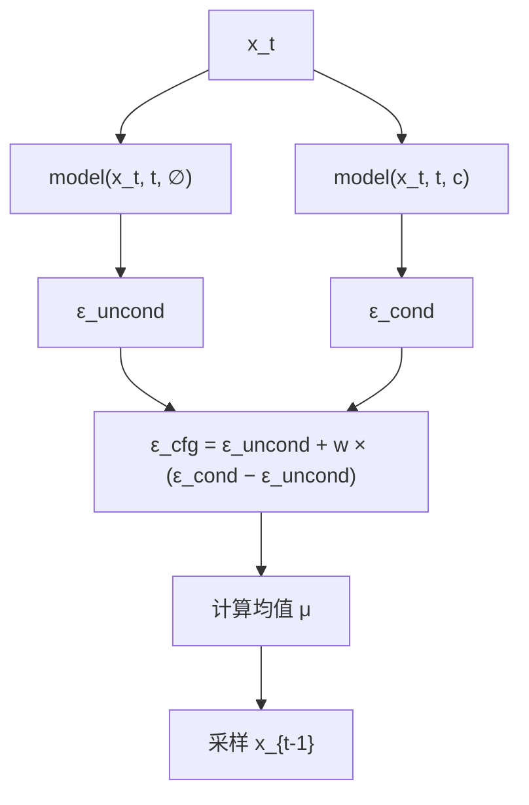

```
┌─────────────────────────────────────────────────────────────────
│                         CFG 完整流程                              
├─────────────────────────────────────────────────────────────────
│                                                                 
│  训练阶段:                                                        
│  ┌──────────────────────────────────────────────────────────────
│  │  每次迭代:                                                 
│  │    90% 概率: 正常条件训练  (x_t, t, c) → εθ → MSE(εθ, ε)    
│  │    10% 概率: 条件置零训练  (x_t, t, ∅) → εθ → MSE(εθ, ε)    
│  │                                                           
│  │  结果: 一个模型，既能条件预测也能无条件预测                      
│  └──────────────────────────────────────────────────────────────
│                              │                                    
│                              ▼                                   
│  推理阶段:                                                       
│  ┌──────────────────────────────────────────────────────────────
│  │  每个时间步 t:                                               
│  │    1. 跑无条件: ε_uncond = model(x_t, t, ∅)                 
│  │    2. 跑有条件: ε_cond   = model(x_t, t, c)                  
│  │    3. 混合:     ε_cfg    = ε_uncond + w×(ε_cond - ε_uncond)  
│  │    4. 用 ε_cfg 做一步去噪                                   
│  │                                                           
│  │  代价: 推理速度减半（每步×2次前向传播）                         
│  │  收益: 条件一致性大幅提升                                     
│  └────────────────────────────────────────────────────────────── 
│                                                             
│  可调节的旋钮:                                                  
│    p_drop: 训练时条件丢弃概率 (10%~20%)                            
│    w:      推理时引导强度 (1.5~7.5)                               
│                                                                  
└─────────────────────────────────────────────────────────────────
```

# 简洁版
**推理时用一种巧妙的计算方式，放大条件对生成结果的影响**。
## 一、训练端：让模型学会"无条件"预测

训练时唯一的变化——**随机把条件置零**。

```
每次迭代:

1. 正常准备条件:
   class_onehot = [0,1,0,0,0,0,0,0,0,0]   # 类别="bmp2"
   az_vec        = [cosθ, sinθ, cos2θ, sin2θ, ...]

2. 以概率 p_drop（通常 10%~20%）丢弃条件:

   if random() < p_drop:
       class_onehot = [0,0,0,0,0,0,0,0,0,0]   # 全零，表示"无条件"
       az_vec       = [0,0,0,0,0,0,0,0,0,0]   # 全零

3. 正常训练:
   εθ = model(x_t, t, class_onehot, az_vec)
   loss = MSE(εθ, ε_true)
   loss.backward()
```

**关键**：置零的向量就是"无条件"的信号。模型看到全零输入 → 学会了在没有任何条件提示时该怎么预测噪声。

以EM_deeplearning_beifen\DDPM项目代码为例，改动位置在 train_ddpm.py，只需在构建条件后插入丢弃逻辑：
```python
# 原来
class_onehot = onehot[labels].to(device)
real_az_vec = ...  # 方位角编码

# 加上 CFG 训练
p_drop = 0.1  # 10% 丢弃
if torch.rand(1).item() < p_drop:
    class_onehot = torch.zeros_like(class_onehot)
    real_az_vec = torch.zeros_like(real_az_vec)
```
## 二、推理端：每个时间步跑两次模型

DDPM 采样时，每个时间步不再只跑一次模型，而是跑两次 → 混合 → 继续，代价是推理时间翻倍（每个时间步跑两次前向传播）：




# 详细版
## 定义

CFG 是一种**推理时的技巧**，通过混合"有条件预测"和"无条件预测"的噪声，放大条件对生成结果的控制力，让模型生成更贴合条件的图像。

---

## 解决什么问题

### 问题场景

假设你训练好了一个类别条件的 DDPM——它能生成"猫"、"狗"、"飞机"等 10 个类别的图像。你告诉模型："给我生成一只猫"。

理想情况下，模型应该 100% 生成猫。但实际训练出来的模型，可能只有 80% 的概率生成猫，还有 20% 的概率生成别的。原因很简单：

- 模型在训练时见过太多类别，它对"猫"和"狗"的边界没有那么确定
- 神经网络天然带有不确定性，在高维空间中"猫"和"类似猫的物体"之间的边界是模糊的

### 类比理解

就像一个画师，你说"画一只猫"，他可能画出一只**既像猫又有点像狗**的东西——因为他同时会画猫和画狗，两种技能互相干扰。

CFG 就像一个**放大镜**：它把"猫"的信号放大，把"不是猫"的信号抑制掉，让画师画出的猫更像猫。

---

## 发展历程：从 Classifier Guidance 到 CFG

### Classifier Guidance（分类器引导）

CFG 有一个"前身"，称为 **Classifier Guidance**。它的思路很直观：

1. 训练一个**额外的分类器** $p_\phi(c \mid x_t)$，这个分类器专门判断"$x_t$ 看起来属于类别 $c$ 的概率"
2. 在采样的每一步，用这个分类器的梯度来"微调"去噪方向：把 $x_t$ 往"更像类别 c"的方向推一推

数学上：
$$\epsilon_\theta^{\text{guided}}(x_t, t, c) = \epsilon_\theta(x_t, t) - s \cdot \sqrt{1-\bar{\alpha}_t} \cdot \nabla_{x_t} \log p_\phi(c \mid x_t)$$

其中 $s$ 是引导强度。

**Classifier Guidance 的问题**：
- 需要额外训练一个分类器——多一个模型，多一份维护
- 分类器必须在**带噪声的图像**上训练（$x_t$，不是 $x_0$），数据准备麻烦
- 需要计算梯度 $\nabla_{x_t} \log p_\phi$，额外开销大

### Classifier-Free Guidance（无分类器引导）

CFG 是 2021 年 Ho & Salimans 提出的改进方案。核心洞察：

> **不需要额外的分类器。有条件模型本身，其实已经同时学会了"有条件"和"无条件"两种去噪能力。**

怎么做到的？——**训练时随机丢掉条件**。

在训练阶段，以一定概率（通常 10%~20%）把条件 $c$ 替换成空条件 $\varnothing$。这样模型既学会了怎么在"有指令"时去噪，也学会了怎么在"没指令"时去噪。

推理时，用贝叶斯公式的变形，直接让"有条件输出"和"无条件输出"做差值，就等价于有了一个隐式的分类器引导。

---

## 核心公式与原理

### 核心公式

$$\epsilon_\theta^{\text{cfg}}(x_t, t, c) = \epsilon_\theta(x_t, t, \varnothing) + w \cdot \big(\epsilon_\theta(x_t, t, c) - \epsilon_\theta(x_t, t, \varnothing)\big)$$

简化写法：
$$\epsilon_\theta^{\text{cfg}} = \text{uncond} + w \cdot (\text{cond} - \text{uncond})$$

**其中**：
- $\epsilon_\theta(x_t, t, c)$：有条件预测的噪声（"这是猫，应该去掉猫以外的噪声"）
- $\epsilon_\theta(x_t, t, \varnothing)$：无条件预测的噪声（"不管是什么，只管去噪"）
- $w$：引导强度（guidance scale），$w \geq 1$

### 直觉理解

把公式拆开看：

| $w$ 值 | 公式展开 | 含义 |
|--------|---------|------|
| $w = 0$ | $\epsilon_\theta(x_t, t, \varnothing)$ | 纯无条件生成，随机出图 |
| $w = 1$ | $\epsilon_\theta(x_t, t, c)$ | 标准条件生成，不加引导 |
| $w = 2$ | $2 \cdot \epsilon_c - 1 \cdot \epsilon_\varnothing$ | 条件信号被放大 1 倍 |
| $w = 5$ | $5 \cdot \epsilon_c - 4 \cdot \epsilon_\varnothing$ | 条件信号被放大 4 倍 |

$(\text{cond} - \text{uncond})$ 其实就是"条件信号的方向向量"——它指向"更符合条件 c"的方向。$w$ 越大，就在这个方向上走得越远。

```
        无条件空间                         有条件空间
           │                                  │
           │    ← (cond - uncond) 方向 ←      │
           │                                  │
           ○──────────────○────────────○──────○
        w=0(随机)     w=1(标准)   w=3(引导)  w=7.5(强引导)
                       ↑            ↑         ↑
                    不加 CFG     更贴合条件   可能过饱和
```

### 为什么这等价于分类器引导

CFG 的公式可以从贝叶斯公式推导出来。核心逻辑：

对于条件扩散模型的得分函数（score function），贝叶斯公式给出：

$$\nabla_{x_t} \log p(x_t \mid c) = \nabla_{x_t} \log p(x_t) + \nabla_{x_t} \log p(c \mid x_t)$$

第一项是无条件得分 → 对应 $\epsilon_\varnothing$
第二项是分类器梯度 → 对应 $(\epsilon_c - \epsilon_\varnothing)$

而扩散模型预测的噪声 $\epsilon_\theta$ 和得分函数有线性关系：$\epsilon_\theta \propto -\nabla_{x_t} \log p(x_t)$

所以：
$$\underbrace{\epsilon_c}_{\text{有条件噪声}} \approx \underbrace{\epsilon_\varnothing}_{\text{无条件得分}} + \underbrace{(\epsilon_c - \epsilon_\varnothing)}_{\text{隐式分类器梯度}}$$

CFG 的精妙之处在于：**它用同一个模型的两次前向传播，替代了一个独立分类器的梯度计算**。

---

## 训练阶段：条件丢弃

### 怎么做

在训练的每个 iteration 中：

```
1. 取一对 (x_0, c) —— 真实图像 + 条件
2. 以概率 p_uncond（如 15%），把 c 替换为 ∅（空条件/零向量）
3. 正常进行前向加噪 + 网络预测 + 计算损失
```

### 代码示意

```python
# 训练循环中
c_original = batch["condition"]        # 真实条件，如类别 one-hot
c_null = torch.zeros_like(c_original)  # 空条件，全零向量

# 随机丢弃
mask = torch.rand(batch_size) < p_uncond  # p_uncond = 0.15
c = torch.where(mask.unsqueeze(1), c_null, c_original)

# 正常训练
noise_pred = model(x_t, t, c)
loss = F.mse_loss(noise_pred, noise_true)
```

### 关键超参数

| 参数 | 推荐值 | 说明 |
|------|--------|------|
| $p_{\text{uncond}}$（丢弃概率） | 10%~20% | 太低→无条件能力不够；太高→有条件能力下降 |
| $\varnothing$（空条件表示） | 全零向量 | 也可以是特殊的可学习嵌入向量 |

---

## 推理阶段：引导采样

### 算法流程

```
for t = T, T-1, ..., 1:
    # 1. 两次前向传播（共享同一个 x_t 和 t）
    ε_cond   = model(x_t, t, c)        # 有条件预测
    ε_uncond = model(x_t, t, ∅)        # 无条件预测

    # 2. CFG 融合
    ε_cfg = ε_uncond + w * (ε_cond - ε_uncond)

    # 3. 用 ε_cfg 做正常 DDPM/DDIM 去噪
    x_{t-1} = denoise_step(x_t, ε_cfg, t)
```

### 计算开销

CFG 让推理的计算量**翻倍**——每一步需要做两次前向传播（一次有条件、一次无条件）。这是 CFG 的主要代价。

---

## $w$ 值的效果：具体例子

### 例子 1：MNIST 手写数字

| $w$ | 效果 |
|-----|------|
| $w = 0$ | 随机生成 0~9，不受控制 |
| $w = 1$ | 大致生成指定数字，但偶尔会"变形"（如 3 看起来像 8） |
| $w = 2$ | 稳定生成指定数字，笔画清晰 |
| $w = 5$ | 数字非常标准，但所有"3"看起来太相似（多样性差） |
| $w = 10$ | 数字过度强化，笔画异常粗，出现伪影 |

### 例子 2：Stable Diffusion 文本到图像

在 Stable Diffusion 等文本条件扩散模型中，CFG 几乎是**必需的**：

| $w$ | 效果 |
|-----|------|
| $w = 1$ | 图像和文本关联弱，可能出现无关内容 |
| $w = 3$ | 较好平衡：图像贴合描述，保留一定多样性 |
| $w = 5 \sim 7$ | **最常用范围**：图像准确反映文本，质量高 |
| $w = 7.5 \sim 9$ | 经典 SD 默认值（7.5），画面更"戏剧化" |
| $w = 15+$ | 过度饱和，色彩失真，出现"烧焦"伪影 |

### $w$ 选择的经验法则

```
                多样性高                     条件一致性好
                  ←──────────────────────────────→
                  │                              │
w 小 (1~2)   中等 (3~5)    常用 (5~7.5)    大 (10+)  →  失真/伪影
                  │                              │
            模糊、不贴合                      过饱和、"烧焦"
```

**一般建议**：从 $w = 3$ 开始尝试，逐步增大到图像开始出现伪影为止，然后退回到前一个值。

---

## CFG 与其他模块的关系

| 相关模块 | 关系 |
|---------|------|
| [[DDPM - Conditioning\|条件注入]] | CFG 的前提——必须先有条件模型（训练时做了条件丢弃） |
| [[DDPM - General Framework#6. 模块四：条件注入机制（Conditioning）\|注入方式]] | 加法偏置、Cross-Attention 等不同注入方式都可以用 CFG |
| [[DDPM - General Framework#7. 模块五：训练管线（Training Pipeline）\|训练管线]] | 训练时必须有 $p_{\text{uncond}}$ 的条件丢弃 |
| [[DDPM - General Framework#8. 模块六：采样管线（Sampling Pipeline）\|采样管线]] | CFG 是采样阶段的操作，每步做两次前向传播 |
| DDIM 加速采样 | CFG 和 DDIM 可以叠加：用 DDIM 减少步数，同时用 CFG 增强条件 |

---

## 总结

| 维度 | 要点 |
|------|------|
| **CFG 是什么** | 推理时通过混合有/无条件噪声输出，放大条件控制力的技巧 |
| **为什么需要** | 条件模型本身的条件跟随性不够强，CFG 用零成本（不需额外模型）增强了条件一致性 |
| **怎么做训练** | 训练时以概率 $p_{\text{uncond}}$（10%~20%）随机将条件置为 $\varnothing$ |
| **怎么做推理** | 每步做两次前向传播，用 $\epsilon_{\text{uncond}} + w(\epsilon_{\text{cond}} - \epsilon_{\text{uncond}})$ 得到引导后的噪声 |
| **$w$ 怎么选** | 从 3 开始，逐步增大，常见范围 1.5~7.5 |
| **代价** | 推理计算量翻倍 |

---


