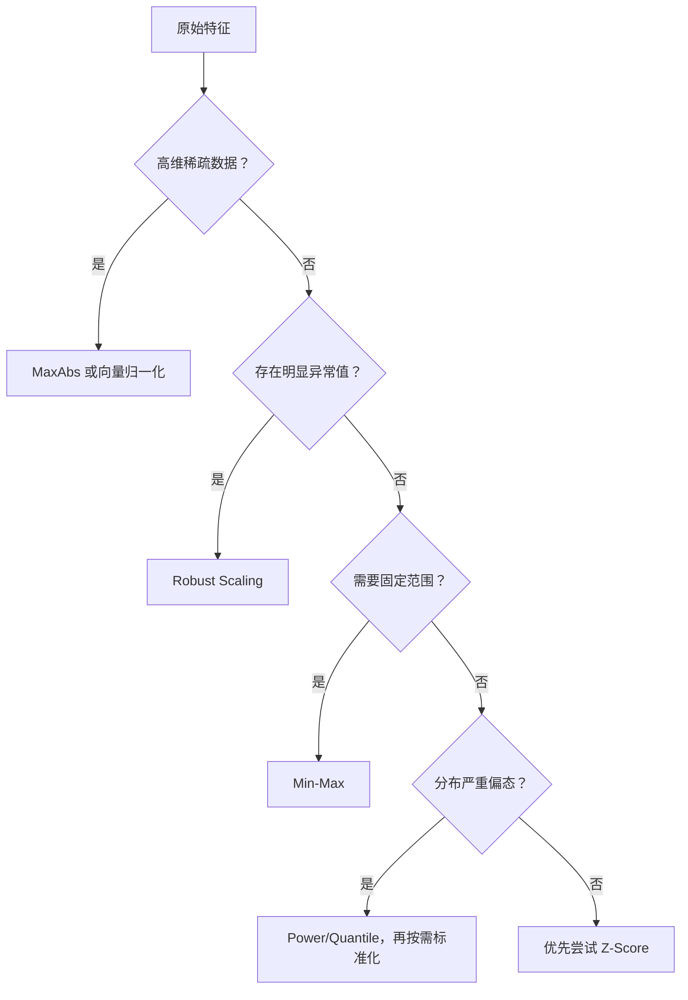

---
tags:
  - Deep-Learning
  - 数据处理
  - normalization
  - standardization
aliases:
  - 数据归一化
  - 数据标准化
related:
  - "[[深度学习基础知识点]]"
  - "[[网络归一化层]]"
---

# 数据归一化与标准化

归一化和标准化是常见的数据预处理技术。它们通过改变输入特征的尺度，让不同量纲的特征处于更可比较的数值范围，通常有助于梯度优化和模型训练。

> [!note]
> 本文讨论训练前的输入数据缩放。BatchNorm、LayerNorm、RMSNorm 等模型内部组件参见 [[网络归一化层]]。

---

## 一、概念辨析

中文语境下“归一化”和“标准化”有时会被笼统地称为 normalization，但二者常指不同操作。

| 术语 | 英文 | 本质 | 典型公式 |
|---|---|---|---|
| **归一化** | Normalization | 将数据映射到指定范围，如 $[0,1]$ 或 $[-1,1]$ | $x'=\frac{x-x_{\min}}{x_{\max}-x_{\min}}$ |
| **标准化** | Standardization | 将数据调整为均值 0、标准差 1 | $x'=\frac{x-\mu}{\sigma}$ |
| **正则化** | Regularization | 对参数或模型复杂度施加约束，缓解过拟合 | $L=L_0+\lambda\lVert\mathbf w\rVert$ |

> [!important]
> 数据归一化/标准化改变的是输入数据；正则化约束的是模型、参数或损失函数。二者不是同一个概念。

---

## 二、为什么要缩放特征？

假设一个特征的取值约为 $0\sim1$，另一个特征约为 $0\sim100000$。如果直接输入模型，大尺度特征可能主导距离、梯度或参数更新，使优化问题呈现狭长的几何形状，导致梯度下降迂回、收敛变慢。

统一尺度通常有以下作用：

- 改善优化问题的数值条件，使梯度下降更容易收敛；
- 避免量纲大的特征仅因数值范围大而占据优势；
- 让依赖距离或内积的方法更合理；
- 降低极端数值导致数值不稳定的风险；
- 使学习率等超参数更容易选择。

对决策树、随机森林等基于特征切分的方法，缩放通常不是必需的；对 KNN、K-Means、SVM、PCA、线性模型及神经网络，特征尺度往往更加重要。

---

## 三、常见缩放方法

### 3.1 Min-Max 归一化

将数据线性映射到 $[0,1]$：

$$
x'=\frac{x-x_{\min}}{x_{\max}-x_{\min}}
$$

映射到任意区间 $[a,b]$：

$$
x'=a+\frac{(x-x_{\min})(b-a)}{x_{\max}-x_{\min}}
$$

**特点：**

- 保留原始分布形状和样本间的相对大小关系；
- 输出范围明确；
- 对异常值非常敏感，一个极端值可能压缩其他正常样本；
- 测试数据超出训练集最小值或最大值时，变换结果可能超出目标区间。

**常见场景：** 图像像素从 `0~255` 缩放到 `0~1`、需要有界输入的模型。

### 3.2 Z-Score 标准化

将数据变为均值约为 0、标准差约为 1：

$$
x'=\frac{x-\mu}{\sigma}
$$

其中 $\mu$ 和 $\sigma$ 必须使用**训练集**估计。

**特点：**

- 不保证输出位于固定区间；
- 常作为连续特征的默认预处理方法；
- 不要求数据必须服从正态分布才能使用；
- 均值和标准差仍会受到异常值影响，只是通常不像 Min-Max 那样直接由两个极值决定。

**常见场景：** 线性模型、逻辑回归、SVM、PCA 和神经网络连续输入特征。

### 3.3 MaxAbs 缩放

将数据除以训练集中的最大绝对值：

$$
x'=\frac{x}{\max(|x|)}
$$

**特点：**

- 通常将训练数据缩放到 $[-1,1]$；
- 不进行中心化，因此原来的 0 仍是 0，不会破坏稀疏矩阵结构；
- 对极端值敏感。

**常见场景：** TF-IDF 等高维稀疏数据。

### 3.4 Robust Scaling（鲁棒缩放）

用中位数和四分位距代替均值与标准差：

$$
x'=\frac{x-\operatorname{median}(x)}{\operatorname{IQR}(x)},
\qquad \operatorname{IQR}=Q_3-Q_1
$$

**特点：**

- 中位数和四分位距受极端异常值影响较小；
- 不保证输出均值为 0、方差为 1，也不保证固定范围；
- 适合异常值真实存在且不能简单删除的情况。

**常见场景：** 金融交易、收入、传感器等可能含有大量异常值的数据。

### 3.5 幂变换（Power Transformation）

幂变换用于减弱偏态、稳定方差，使分布更接近对称或正态，然后通常还会进一步标准化。

#### Box-Cox 变换

要求输入严格大于 0：

$$
x'=\begin{cases}
\frac{x^\lambda-1}{\lambda},&\lambda\neq0\\
\ln x,&\lambda=0
\end{cases}
$$

#### Yeo-Johnson 变换

Yeo-Johnson 是可处理 0 和负值的推广形式：

$$
x'=\begin{cases}
\frac{(x+1)^\lambda-1}{\lambda},&x\geq0,\lambda\neq0\\
\ln(x+1),&x\geq0,\lambda=0\\
-\frac{(-x+1)^{2-\lambda}-1}{2-\lambda},&x<0,\lambda\neq2\\
-\ln(-x+1),&x<0,\lambda=2
\end{cases}
$$

**特点：**

- 会改变分布形状，而不只是线性缩放；
- $\lambda$ 通常根据训练数据估计；
- 适合收入、人口、点击量等长尾特征；
- 变换参数必须只在训练集上拟合，再应用到验证集和测试集。

### 3.6 分位数变换（Quantile Transformation）

分位数变换根据样本的经验累计分布函数或排序，将数据映射到均匀分布或近似正态分布。

**特点：**

- 可以把非常不规则的分布变为指定边际分布；
- 会将异常值压缩到分布两端；
- 属于非线性变换，可能扭曲特征之间原有的线性关系；
- 需要足够的训练样本估计分位数。

**常见场景：** 特征分布极不规则、异常值很多，并且下游方法可接受非线性秩变换。

### 3.7 向量归一化

有时 normalization 不是按“特征列”缩放，而是把每个样本向量缩放为单位范数。例如 L2 归一化：

$$
\mathbf{x}'=\frac{\mathbf{x}}{\lVert\mathbf{x}\rVert_2}
$$

它保留向量方向而改变长度，常用于文本向量、Embedding、余弦相似度和度量学习。它与 Min-Max 归一化不是同一种操作。

---

## 四、方法对比

| 方法 | 输出范围 | 异常值敏感度 | 是否改变分布形状 | 保留稀疏性 |
|---|---|:---:|:---:|:---:|
| Min-Max | 通常 $[0,1]$ | 高 | 否 | 否 |
| Z-Score | 无界 | 中等 | 否 | 否 |
| MaxAbs | 训练集通常 $[-1,1]$ | 高 | 否 | 是 |
| Robust | 无界 | 低 | 否 | 通常否 |
| Power | 无界 | 视数据而定 | 是 | 否 |
| Quantile | $[0,1]$ 或近似 $\mathcal N(0,1)$ | 低 | 是 | 否 |
| L2 向量归一化 | 单位范数 | 视向量而定 | 改变向量长度 | 可保留零元素 |

---

## 五、选择指南



常见经验：

- 不确定时，可先尝试 Z-Score，再用验证集比较其他方案；
- 图像可缩放至 `0~1`，使用预训练模型时应采用该模型约定的通道均值与标准差；
- Embedding 常按任务需要做 L2 归一化，而不是逐维 Min-Max；
- 树模型通常不依赖特征尺度，但仍可能受极端值和数据质量影响；
- 数据严重偏态时，可以先做对数或幂变换，再做标准化。

---

## 六、避免数据泄漏

数据缩放中最重要的工程原则是：**只用训练集拟合统计量**。

正确流程：

```text
划分训练集、验证集、测试集
        ↓
只在训练集上计算 min/max、均值/标准差、分位数或 λ
        ↓
用同一组统计量变换训练集、验证集和测试集
```

不能先用全部数据计算统计量再划分数据集，因为验证集和测试集的信息会泄漏到训练过程，使评估结果偏乐观。

交叉验证时，应在每个 fold 的训练子集上单独拟合 scaler。使用 scikit-learn 时，推荐将 scaler 与模型放入 `Pipeline`，避免无意泄漏。

```python
from sklearn.pipeline import make_pipeline
from sklearn.preprocessing import StandardScaler
from sklearn.linear_model import LogisticRegression

pipeline = make_pipeline(
    StandardScaler(),
    LogisticRegression(),
)
pipeline.fit(X_train, y_train)
predictions = pipeline.predict(X_test)
```

---

## 七、总结

- **Min-Max 归一化**把特征映射到指定范围，直观但对异常值敏感；
- **Z-Score 标准化**使特征均值约为 0、标准差约为 1，是常见默认方案；
- **Robust Scaling**适合包含明显异常值的数据；
- **Power/Quantile**会改变分布形状，适合严重偏态或不规则分布；
- **MaxAbs**适合不希望破坏稀疏结构的数据；
- **向量归一化**调整的是每个样本向量的长度，常用于 Embedding 和相似度计算；
- 所有预处理统计量都必须只在训练集上拟合，以避免数据泄漏。

