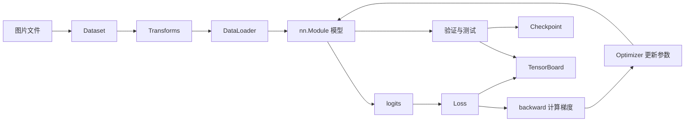

# PyTorch 学习笔记（基于 Learning-PyTorch 项目）

> [!abstract] 笔记说明
> 本笔记根据 `D:\VScode_Files\Learning-PyTorch` 项目中的 `Ch00`～`Ch19` 章节脚本，以及 `Complete training process` 完整训练工程整理。目标不是简单抄录 API，而是把数据、模型、损失、反向传播、优化、验证、测试和模型保存串成一条完整主线。

## 1. 项目内容与推荐学习路线

项目中的有效学习内容主要分为三组：

1. `Ch00`～`Ch07`：数据读取、数据预处理、批量加载与 TensorBoard。
2. `Ch08`～`Ch19`：神经网络模块、CNN 常见层、损失函数、反向传播、优化器、迁移学习和模型保存。
3. `Complete training process/`：将前面的零散知识组装成一个规范的 CIFAR-10 训练、验证、测试工程。

虚拟环境 `learnpytorchvenv/`、CIFAR-10 原始数据、蚂蚁蜜蜂图片、TensorBoard 事件文件和 `__pycache__` 都不是需要阅读的源码。`Awesome Flow Matching ( Stochastic Interpolant ).md` 是 Flow Matching 论文索引，属于生成模型方向的进阶资料，不是当前 CIFAR-10 分类主线的一部分。



推荐按下面的顺序学习：

- 第一阶段：`Dataset → Transform → DataLoader`，掌握数据如何变成批量张量。
- 第二阶段：`nn.Module → Conv2d → Pooling → Linear`，掌握模型和形状变化。
- 第三阶段：`Loss → backward → optimizer.step()`，掌握模型如何学习。
- 第四阶段：训练集、验证集、测试集和 checkpoint，掌握完整实验规范。
- 第五阶段：预训练 VGG16 和迁移学习，理解如何利用已有模型。

---

## 2. 一张图理解 PyTorch 训练

一个标准监督学习任务包含五个核心对象：

| 对象 | 项目中的例子 | 作用 |
| --- | --- | --- |
| 数据 | CIFAR-10 图片与类别编号 | 提供输入 `images` 和目标 `targets` |
| 模型 | `EasyNN` | 把图片映射为 10 个类别分数 |
| 损失函数 | `CrossEntropyLoss` | 衡量预测与真实标签的差距 |
| 自动微分 | `loss.backward()` | 计算每个可训练参数的梯度 |
| 优化器 | `SGD` | 根据梯度更新参数，使损失逐渐降低 |

最核心的训练循环可以浓缩为：

```python
model.train()

for images, targets in train_loader:
    images = images.to(device)
    targets = targets.to(device)

    outputs = model(images)          # 前向传播，得到 logits
    loss = loss_fn(outputs, targets) # 计算损失

    optimizer.zero_grad()            # 清除上一轮梯度
    loss.backward()                  # 反向传播，计算当前梯度
    optimizer.step()                 # 更新模型参数
```

必须牢记这四句的顺序：

```text
forward → loss → zero_grad → backward → step
```

其中，`model(images)` 不会直接给出类别名称，而是返回形状为 `[batch_size, num_classes]` 的 **logits**。例如 CIFAR-10 的一个批次可能是：

```text
images.shape  = [64, 3, 32, 32]
targets.shape = [64]
outputs.shape = [64, 10]
```

---

## 3. 张量与图像的基础约定

### 3.1 PyTorch 图像形状

常见图像表示有两种：

| 工具 | 单张图像常见形状 | 通道顺序 |
| --- | --- | --- |
| PIL / NumPy | `[H, W, C]` | 高、宽、通道，简称 HWC |
| PyTorch | `[C, H, W]` | 通道、高、宽，简称 CHW |

加入 batch 维度后，PyTorch CNN 通常接收：

```text
[N, C, H, W]
```

- `N`：batch size。
- `C`：通道数，RGB 图片为 3。
- `H`：高度。
- `W`：宽度。

### 3.2 PIL 与 OpenCV 的差异

- `PIL.Image.open()` 默认以 RGB 语义处理彩色图片。
- `cv2.imread()` 默认通道顺序为 BGR。
- 自定义数据集最好使用 `.convert("RGB")`，避免灰度图、RGBA 图或异常图片造成通道数不一致。

### 3.3 `ToTensor` 的准确行为

`transforms.ToTensor()` 通常完成两件事：

1. 将 PIL 图片或 NumPy 数组从 HWC 转为 CHW。
2. 当输入是 `uint8` 图片时，将数值从 `[0, 255]` 转为 `float32` 的 `[0, 1]`。

> [!warning] 项目中的一处早期注释需要修正
> `ToTensor()` 并不是对所有 NumPy 数组都“保持原值”。对常见的 `uint8` NumPy 图像，它同样会除以 255；只有输入不是受支持的 8 位图片类型时，才通常不会自动缩放。不要只根据“PIL 还是 NumPy”判断是否缩放，还要看数据类型。

---

## 4. 自定义 Dataset：让自己的图片可被 PyTorch 使用

项目的 `Ch01_read_dataset.py` 定义了一个最小自定义数据集。自定义数据集需要继承 `torch.utils.data.Dataset`，并实现三个部分：

```python
from torch.utils.data import Dataset

class MyDataset(Dataset):
    def __init__(self, root_dir, label_dir, transform=None):
        self.root_dir = root_dir
        self.label_dir = label_dir
        self.transform = transform
        self.image_dir = os.path.join(root_dir, label_dir)
        self.image_names = os.listdir(self.image_dir)

    def __len__(self):
        return len(self.image_names)

    def __getitem__(self, index):
        image_path = os.path.join(self.image_dir, self.image_names[index])
        image = Image.open(image_path).convert("RGB")
        label = self.label_dir

        if self.transform is not None:
            image = self.transform(image)

        return image, label
```

### 4.1 三个方法各自负责什么

- `__init__`：保存路径、读取文件名列表、保存 transform。它在创建数据集对象时执行一次。
- `__len__`：告诉 PyTorch 数据集有多少个样本，使 `len(dataset)` 可用。
- `__getitem__`：根据索引读取一个样本，使 `dataset[i]` 可用。

`DataLoader` 的本质就是不断调用 `dataset[index]`，再把多个样本拼成 batch。

### 4.2 标签应该如何表示

早期示例返回字符串标签，如 `"ants_image"`。查看数据没有问题，但训练分类器时，应返回整数类别索引：

```python
label_to_index = {"ants": 0, "bees": 1}
```

因为 `CrossEntropyLoss` 常用的 target 必须是 `torch.long` 类型的类别编号，取值范围为 `[0, num_classes)`。

### 4.3 拼接数据集

项目使用：

```python
train_dataset = ants_dataset + bees_dataset
```

这会得到一个 `ConcatDataset`。它只是把两个数据集按索引逻辑拼在一起，并不会把所有图片提前复制到内存。

### 4.4 更稳健的数据集实现建议

- 对文件名排序，便于复现：`sorted(os.listdir(...))`。
- 过滤非图片文件，避免误读系统文件。
- 统一 `.convert("RGB")`。
- 返回整数标签。
- 将随机数据增强只用于训练集，不用于验证集和测试集。
- 如果某张图损坏，应在数据检查阶段定位，不要静默吞掉所有异常。

---

## 5. Transforms：构建图像预处理流水线

### 5.1 `Compose`

`transforms.Compose` 会按给定顺序依次执行变换：

```python
train_transform = transforms.Compose([
    transforms.RandomCrop(32, padding=4),
    transforms.RandomHorizontalFlip(),
    transforms.ToTensor(),
    transforms.Normalize(mean, std),
])
```

顺序非常重要。例如 `Normalize` 接收 Tensor，因此一般要放在 `ToTensor` 后面。

### 5.2 `Resize`

```python
transforms.Resize((128, 128))
```

强制输出为高 128、宽 128，可能改变原始宽高比。

```python
transforms.Resize(128)
```

把短边缩放到 128，并保持宽高比。

### 5.3 `Normalize`

逐通道标准化公式：

$$
y_c = \frac{x_c - \mu_c}{\sigma_c}
$$

例如：

```python
transforms.Normalize(
    mean=(0.4914, 0.4822, 0.4465),
    std=(0.2023, 0.1994, 0.2010),
)
```

标准化后的值不再局限在 `[0,1]`。如果直接把标准化后的张量写入 TensorBoard，颜色可能失真。用于可视化时可保留一套只执行 `ToTensor()` 的 transform，或者先做反标准化。

### 5.4 数据增强

完整训练工程对 CIFAR-10 使用：

```python
transforms.RandomCrop(32, padding=4)
transforms.RandomHorizontalFlip()
```

其目的不是增加磁盘上的图片数量，而是在每次取样时随机生成略有不同的输入，降低过拟合。

训练集可以使用随机增强；验证集和测试集只做确定性预处理：

```python
TRANSFORM_EVAL = transforms.Compose([
    transforms.ToTensor(),
    transforms.Normalize(mean, std),
])
```

否则同一个模型每次验证都会看到不同的随机图像，指标会出现不必要的波动。

---

## 6. torchvision 内置数据集与 CIFAR-10

项目主要使用：

```python
train_set = torchvision.datasets.CIFAR10(
    root="./CIFAR10",
    train=True,
    transform=train_transform,
    download=True,
)
```

关键参数：

- `root`：数据保存位置。
- `train=True`：官方 50,000 张训练图片。
- `train=False`：官方 10,000 张测试图片。
- `transform`：每次读取图片时应用的变换。
- `download`：本地不存在时是否下载。

常用属性与访问方式：

```python
image, target = train_set[0]
class_name = train_set.classes[target]
```

CIFAR-10 的 10 类是：飞机、汽车、鸟、猫、鹿、狗、青蛙、马、船、卡车。模型最终输出 10 个 logits，分别对应这 10 个类别。

---

## 7. DataLoader：从单个样本到批量数据

```python
train_loader = DataLoader(
    dataset=train_dataset,
    batch_size=64,
    shuffle=True,
    num_workers=0,
    drop_last=False,
    pin_memory=torch.cuda.is_available(),
)
```

### 7.1 关键参数

| 参数 | 含义 | 常见设置 |
| --- | --- | --- |
| `dataset` | 被加载的数据集 | 自定义 Dataset 或 torchvision Dataset |
| `batch_size` | 每批样本数 | 32、64、128 等 |
| `shuffle` | 每个 epoch 是否打乱 | 训练 `True`，验证/测试 `False` |
| `num_workers` | 并行加载数据的子进程数 | Windows 初学阶段可从 0 开始 |
| `drop_last` | 是否丢弃最后一个不足整批的 batch | 通常 `False` |
| `pin_memory` | 是否使用页锁定内存加速 CPU→GPU 复制 | CUDA 可用时设为 `True` |

`num_workers=0` 是最容易调试的设置，但不一定是速度最快的设置。Windows 上提高它时，入口代码必须放在：

```python
if __name__ == "__main__":
    main()
```

### 7.2 为什么训练集打乱，测试集不打乱

- 训练打乱可减少固定样本顺序造成的偏差。
- 验证和测试不需要靠顺序学习参数，关闭打乱便于复现与定位具体样本。

### 7.3 `drop_last` 的影响

假设数据集有 100 个样本，`batch_size=64`：

- `drop_last=False`：得到 64 和 36 两批，共 100 个样本。
- `drop_last=True`：只保留 64 个样本，最后 36 个被丢弃。

普通分类任务通常不必丢弃最后一批。BatchNorm 对极小 batch 敏感时，或某些模型要求固定 batch size 时，才更常考虑 `drop_last=True`。

---

## 8. TensorBoard：观察图像、曲线和计算图

项目使用 `SummaryWriter` 记录三类内容：

```python
from torch.utils.tensorboard import SummaryWriter

writer = SummaryWriter("logs")
writer.add_image("sample", image, global_step=0)
writer.add_images("batch", images, global_step=0)
writer.add_scalar("train/loss", loss_value, global_step)
writer.add_graph(model, example_input)
writer.close()
```

### 8.1 单张与批量图像

- `add_image` 默认常用 CHW。
- NumPy 图片若是 HWC，应传入 `dataformats="HWC"`。
- `add_images` 常用 NCHW。

### 8.2 `global_step`

若每个 epoch 都从 step 0 开始写入同一个标签，曲线横轴会重叠。项目完整训练代码让 `global_step` 跨 epoch 累加：

```python
global_step += 1
writer.add_scalar("train/batch_loss", loss.item(), global_step)
```

### 8.3 启动方式

在项目根目录可以运行：

```powershell
& .\learnpytorchvenv\python.exe -m tensorboard.main --logdir .\logs_CIFAR10
```

然后访问终端给出的地址，通常是 `http://localhost:6006`。

---

## 9. `nn.Module`：所有模型的基础

项目 `Ch08_NN_Module.py` 展示了最小模型：

```python
class EasyNN(nn.Module):
    def __init__(self):
        super().__init__()

    def forward(self, x):
        return x + 1
```

调用时应写：

```python
output = model(x)
```

而不是手动写 `model.forward(x)`。`model(x)` 会经过 `nn.Module.__call__`，从而正确处理 hooks、混合精度及框架内部逻辑，然后再调用 `forward`。

### 9.1 `__init__` 与 `forward`

- `__init__`：定义具有状态的层和参数，例如 `nn.Conv2d`、`nn.Linear`。
- `forward`：规定输入张量怎样流过这些层。

只要把子模块赋值给 `self`，PyTorch 就会自动注册其中的参数：

```python
self.conv = nn.Conv2d(3, 32, 3)
```

这样 `model.parameters()`、`.to(device)`、`state_dict()` 才能找到它们。

---

## 10. CNN 中的常见层

### 10.1 二维卷积 `Conv2d`

```python
nn.Conv2d(
    in_channels=3,
    out_channels=32,
    kernel_size=5,
    stride=1,
    padding=2,
)
```

卷积输出空间尺寸公式：

$$
H_{out}=\left\lfloor\frac{H_{in}+2P-D(K-1)-1}{S}+1\right\rfloor
$$

宽度同理。

当 `kernel_size=5`、`stride=1`、`padding=2`、`dilation=1` 时，输出高宽与输入相同：

```text
[N, 3, 32, 32] → [N, 32, 32, 32]
```

`out_channels=32` 表示模型学习 32 个卷积核，产生 32 张特征图。

参数量公式：

$$
\text{params}=C_{out}\times(C_{in}\times K_h\times K_w)+C_{out}
$$

最后一项是每个输出通道的 bias。

> [!note] 关于 Ch09 的可视化 reshape
> 示例把 `[N,6,30,30]` reshape 为 `[-1,3,30,30]`，只是为了让 TensorBoard 把 6 个特征通道按两组 RGB 图显示。它改变了 batch 语义，并不代表卷积实际生成了更多独立样本。观察特征图时，更严谨的做法是逐通道显示或使用 `make_grid`。

### 10.2 激活函数 ReLU

$$
\operatorname{ReLU}(x)=\max(0,x)
$$

卷积和线性层本身是线性/仿射变换。若网络中完全没有非线性激活，多层线性变换仍可以合并为一个线性变换，表达能力有限。因此常见写法是：

```python
nn.Conv2d(...),
nn.ReLU(inplace=True),
```

完整训练工程已经在每个卷积层以及第一个全连接层后加入 ReLU，比 `Ch14` 的早期顺序模型更完整。

### 10.3 最大池化 `MaxPool2d`

```python
nn.MaxPool2d(kernel_size=2, stride=2)
```

它在每个 `2×2` 窗口中保留最大值，使高宽减半：

```text
[N, 32, 32, 32] → [N, 32, 16, 16]
```

池化不会改变通道数。作用包括：

- 降低空间分辨率和计算量。
- 扩大后续特征对原图的感受野。
- 保留局部最强响应。

`ceil_mode=False` 默认使用向下取整；`True` 时对边缘不完整窗口采用向上取整逻辑。

### 10.4 Batch Normalization

```python
nn.BatchNorm2d(num_features=32)
```

对输入 `[N,C,H,W]`，`num_features` 必须等于 `C`。BatchNorm 为每个通道维护运行均值和方差，并学习缩放参数 $\gamma$ 与偏移参数 $\beta$。

- `model.train()`：使用当前 batch 统计量，并更新 running statistics。
- `model.eval()`：使用训练期间累计的运行统计量。

因此验证和推理前必须调用 `model.eval()`。

补充比较：

- `BatchNorm`：依赖 batch 统计量，大 batch 的 CNN 中常见。
- `GroupNorm`：把通道分组后归一化，对小 batch 更稳定。
- `LayerNorm`：对样本内部指定维度归一化，在 Transformer 中尤其常见。

### 10.5 Dropout

```python
nn.Dropout(p=0.5)
```

- 训练模式：以概率 `p` 把元素置零，其余元素除以 `1-p`，保持期望不变。
- 评估模式：等价于恒等映射，不再随机置零。

普通 `nn.Dropout` 是逐元素随机失活；CNN 若希望按整个通道失活，可使用 `nn.Dropout2d`。

### 10.6 Flatten

```python
nn.Flatten()
```

默认保留 batch 维，把其余维度展平：

```text
[N, 64, 4, 4] → [N, 1024]
```

### 10.7 Linear

```python
nn.Linear(in_features=1024, out_features=64)
```

线性层只变换输入最后一维：

$$
y=xA^T+b
$$

因此：

```text
[N, 1024] → [N, 64]
```

`in_features` 必须与上一层输出的最后一维吻合。CNN 中最常见的形状错误，就是卷积/池化后的展平长度算错。

### 10.8 Sequential

```python
self.model = nn.Sequential(
    nn.Conv2d(3, 32, 5, padding=2),
    nn.ReLU(),
    nn.MaxPool2d(2),
    nn.Flatten(),
    nn.Linear(...),
)
```

适合单输入、单输出、严格串行的结构。若模型存在残差连接、多分支、多输入或需要返回中间特征，直接在 `forward` 中写逻辑更清晰。

---

## 11. EasyNN 的完整形状推导

完整工程中的 `EasyNN` 接收 `[N,3,32,32]`：

| 顺序 | 层 | 输出形状 | 参数量 |
| ---: | --- | --- | ---: |
| 0 | 输入 | `[N,3,32,32]` | 0 |
| 1 | `Conv2d(3,32,5,padding=2)` | `[N,32,32,32]` | 2,432 |
| 2 | `ReLU` | `[N,32,32,32]` | 0 |
| 3 | `MaxPool2d(2)` | `[N,32,16,16]` | 0 |
| 4 | `Conv2d(32,32,5,padding=2)` | `[N,32,16,16]` | 25,632 |
| 5 | `ReLU` | `[N,32,16,16]` | 0 |
| 6 | `MaxPool2d(2)` | `[N,32,8,8]` | 0 |
| 7 | `Conv2d(32,64,5,padding=2)` | `[N,64,8,8]` | 51,264 |
| 8 | `ReLU` | `[N,64,8,8]` | 0 |
| 9 | `MaxPool2d(2)` | `[N,64,4,4]` | 0 |
| 10 | `Flatten` | `[N,1024]` | 0 |
| 11 | `Linear(1024,64)` | `[N,64]` | 65,600 |
| 12 | `ReLU` | `[N,64]` | 0 |
| 13 | `Linear(64,10)` | `[N,10]` | 650 |

总可训练参数量：

```text
145,578
```

最后的 `[N,10]` 是 logits，不需要在模型中追加 Softmax。

---

## 12. 损失函数

### 12.1 MSELoss：常用于回归

$$
\operatorname{MSE}=\frac{1}{n}\sum_{i=1}^{n}(\hat y_i-y_i)^2
$$

```python
loss_fn = nn.MSELoss()
loss = loss_fn(predictions, targets)
```

预测值和目标通常应具有相同形状。

### 12.2 CrossEntropyLoss：多分类

```python
loss_fn = nn.CrossEntropyLoss()
loss = loss_fn(outputs, targets)
```

典型形状和类型：

```text
outputs: [N,C]，float logits
targets: [N]，torch.long 类别索引
```

`CrossEntropyLoss` 内部已经组合了 `LogSoftmax` 和 `NLLLoss`。训练时提前写 `Softmax` 不但多余，还可能降低数值稳定性。

预测类别时：

```python
predictions = outputs.argmax(dim=1)
```

二分类常用 `BCEWithLogitsLoss`，它同样要求输入原始 logits，而不是提前 Sigmoid 后的概率。

### 12.3 `reduction`

- `"none"`：保留每个样本或元素的损失。
- `"mean"`：取平均，默认设置。
- `"sum"`：求和。

完整工程统计 epoch 平均损失时使用：

```python
total_loss += loss.item() * batch_size
epoch_loss = total_loss / total_samples
```

这是对所有样本做加权平均。若直接平均每个 batch 的平均 loss，最后一个较小 batch 会获得与完整 batch 相同的权重。

---

## 13. 自动微分、反向传播与梯度

前向传播时，PyTorch 动态记录张量运算并建立计算图。调用：

```python
loss.backward()
```

会根据链式法则计算损失对所有可训练参数的偏导数，结果保存到参数的 `.grad` 中：

```python
print(model.model1[0].weight.grad)
```

### 13.1 梯度默认累加

PyTorch 不会自动覆盖已有梯度，而是累加到 `.grad`。因此每个训练 batch 一般要先清理梯度：

```python
optimizer.zero_grad()
loss.backward()
optimizer.step()
```

也可以使用：

```python
optimizer.zero_grad(set_to_none=True)
```

它通常能减少内存写入，但初学阶段用默认写法更直观。

### 13.2 `loss.item()`

`loss` 是连接计算图的零维 Tensor；`loss.item()` 是普通 Python 数值。做日志和统计时应使用后者：

```python
running_loss += loss.item()
```

> [!warning] Ch17 的早期示例
> `running_loss = running_loss + result_loss` 会使累计变量继续关联计算图，可能增加内存占用。完整训练工程使用 `loss.item() * batch_size`，这是更规范的写法。

---

## 14. 优化器：如何根据梯度更新参数

项目使用 SGD：

```python
optimizer = torch.optim.SGD(
    model.parameters(),
    lr=1e-2,
)
```

最基础的 SGD 更新可理解为：

$$
\theta_{t+1}=\theta_t-\eta\nabla_\theta L
$$

- $\theta$：模型参数。
- $\eta$：学习率。
- $\nabla_\theta L$：损失对参数的梯度。

常见优化器：

- `SGD`：简单、稳定；搭配 `momentum` 常能改善训练。
- `Adam`：为参数维护一阶和二阶矩估计，默认学习率常从 `1e-3` 附近尝试。
- `AdamW`：将权重衰减与梯度更新解耦，现代模型中很常见。

学习率是最关键的超参数之一：太大可能震荡或发散，太小则训练缓慢。完整工程目前使用固定学习率，后续可加入 `StepLR`、`CosineAnnealingLR` 等调度器。

> [!warning] 数据用途纠正
> `Ch16` 和 `Ch17` 为了演示反向传播，直接遍历了 CIFAR-10 的官方测试集。它适合说明 API，但不适合作为真实实验流程。任何用于 `optimizer.step()` 的样本都属于训练数据；官方测试集必须留到最后，只做一次客观评估。完整训练工程已经正确修复了这一点。

---

## 15. 训练、验证和测试必须分开

完整工程采用：

| 阶段 | 数据数量 | 更新参数 | 主要用途 |
| --- | ---: | ---: | --- |
| 训练 | 45,000 | 是 | 学习权重 |
| 验证 | 5,000 | 否 | 选择最佳 epoch 和超参数 |
| 测试 | 10,000 | 否 | 最终客观报告效果 |

为什么不能根据测试准确率反复改模型？因为每一次查看并据此做决策，都在把测试集信息泄漏进建模过程。最终测试结果就会变得过于乐观。

### 15.1 固定划分

项目用固定随机种子产生索引：

```python
generator = torch.Generator().manual_seed(42)
indices = torch.randperm(len(train_full), generator=generator).tolist()
```

然后前 45,000 个索引作为训练集，后 5,000 个作为验证集。固定种子保证下次运行仍使用相同划分，实验才可比较。

### 15.2 为什么创建两个 CIFAR-10 实例

项目创建 `train_full` 和 `val_full` 两个对象，再用相同索引体系构建 `Subset`：

- `train_full` 使用随机数据增强。
- `val_full` 只使用确定性预处理。

如果只创建一个 Dataset 再切分，两个 Subset 会共享同一个 transform，验证集也可能被随机增强。

---

## 16. `model.train()`、`model.eval()` 与推理模式

### 16.1 训练模式

```python
model.train()
```

它会让 Dropout、BatchNorm 等模块使用训练行为，但不会自动进行反向传播，也不会自动更新参数。

### 16.2 评估模式

```python
model.eval()
```

它会关闭 Dropout 的随机失活，并让 BatchNorm 使用运行统计量，但不会自动禁止梯度计算。

### 16.3 禁止梯度

完整工程的评估函数使用：

```python
@torch.inference_mode()
def evaluate(...):
    model.eval()
    ...
```

`inference_mode()` 比仅仅 `eval()` 更进一步：不构建反向传播图，减少内存占用和计算开销。常见的 `torch.no_grad()` 也能关闭梯度记录，但 `inference_mode()` 对纯推理场景限制更强、优化更多。

---

## 17. 完整训练工程拆解

项目结构：

```text
Complete training process/
├── config.py
├── train.py
├── test.py
├── data/
│   └── dataset.py
├── models/
│   └── easy_nn.py
├── utils/
│   ├── train_epoch.py
│   ├── evaluate.py
│   └── checkpoint.py
└── checkpoints/
    └── best_model.pth
```

这种拆分遵循“一个文件负责一类事情”的原则：

- `config.py`：路径、batch size、学习率、epoch 数、随机种子。
- `data/dataset.py`：数据增强、数据划分和 DataLoader。
- `models/easy_nn.py`：只定义网络结构。
- `utils/train_epoch.py`：只负责一个 epoch 的训练。
- `utils/evaluate.py`：验证和测试共用的无梯度评估。
- `utils/checkpoint.py`：模型状态的保存与加载。
- `train.py`：组装各模块，控制训练主流程。
- `test.py`：加载最佳模型并执行最终测试。

### 17.1 `train.py` 的执行顺序

```text
选择 device
  ↓
设置随机种子
  ↓
创建 train/val DataLoader
  ↓
创建模型、损失函数、优化器、SummaryWriter
  ↓
循环每个 epoch
  ├─ train_one_epoch
  ├─ evaluate on validation set
  ├─ 写 TensorBoard
  └─ 如果 val accuracy 更高，保存 checkpoint
  ↓
关闭 SummaryWriter，报告最佳验证准确率
```

使用 `try/finally` 关闭 writer 是一个好习惯：即使训练中途抛出异常，日志文件也能被正确关闭。

### 17.2 正确统计准确率

```python
total_correct += (outputs.argmax(dim=1) == targets).sum().item()
total_samples += targets.size(0)
accuracy = total_correct / total_samples
```

这里统计的是整个 epoch 的样本级准确率，不受最后一个 batch 大小影响。

### 17.3 设备迁移

模型与数据必须位于同一设备：

```python
device = torch.device("cuda" if torch.cuda.is_available() else "cpu")
model = model.to(device)
images = images.to(device, non_blocking=True)
targets = targets.to(device, non_blocking=True)
```

如果模型在 GPU、输入仍在 CPU，会出现设备不一致错误。

---

## 18. 模型保存、加载与 checkpoint

### 18.1 只保存 `state_dict`：推理和发布常用

```python
torch.save(model.state_dict(), "model.pth")
```

加载前先创建同样结构：

```python
model = EasyNN()
state_dict = torch.load(
    "model.pth",
    map_location="cpu",
    weights_only=True,
)
model.load_state_dict(state_dict)
model.eval()
```

优点是文件更稳定、结构更透明；缺点是加载端必须拥有相同模型定义。

### 18.2 保存 checkpoint：断点续训与最佳模型

完整项目保存：

```python
{
    "epoch": epoch,
    "model_state_dict": model.state_dict(),
    "optimizer_state_dict": optimizer.state_dict(),
    "best_val_accuracy": best_val_accuracy,
}
```

其中优化器状态很重要。例如带 momentum 的 SGD、Adam 都有需要恢复的内部状态。只恢复模型参数并不等于完整续训。

### 18.3 保存完整模型对象

```python
torch.save(model, "full_model.pth")
```

这种方式依赖 Python 类路径和代码环境，重构代码后容易失效，通常不作为长期保存首选。加载 pickle 类文件也有安全风险，只能加载可信来源的文件。

### 18.4 `map_location`

```python
torch.load(path, map_location=device)
```

它决定保存的张量加载到哪个设备。GPU 上保存的权重若要在 CPU 机器加载，应显式使用 `map_location="cpu"` 或目标 `device`。

### 18.5 当前完整工程的可改进点

项目 checkpoint 已保存优化器状态，但 `train.py` 目前没有命令行参数或分支来真正恢复训练。后续可加入：

```text
--resume checkpoints/best_model.pth
```

加载模型、优化器、起始 epoch 和历史最佳验证准确率后继续训练。

---

## 19. 预训练模型与迁移学习

项目使用新版 torchvision API：

```python
from torchvision import models
from torchvision.models import VGG16_Weights

weights = VGG16_Weights.DEFAULT
model = models.vgg16(weights=weights)
preprocess = weights.transforms()
```

预训练模型已经在 ImageNet 上学习了通用的边缘、纹理和物体结构。迁移到 CIFAR-10 时，需要替换最后的 1000 分类层：

```python
in_features = model.classifier[6].in_features
model.classifier[6] = nn.Linear(in_features, 10)
```

替换后：

- 卷积特征和前面分类层仍保留预训练权重。
- 新的 `Linear(4096,10)` 是随机初始化的。

### 19.1 两种训练策略

只训练新分类头：

```python
for parameter in model.features.parameters():
    parameter.requires_grad = False

optimizer = torch.optim.Adam(model.classifier[6].parameters(), lr=1e-3)
```

适合数据少、训练快的初始实验。

微调整个网络：

```python
optimizer = torch.optim.Adam(model.parameters(), lr=1e-4)
```

通常用更小学习率，避免快速破坏已有预训练特征。

### 19.2 预处理必须匹配权重

`weights.transforms()` 提供与预训练权重匹配的 Resize、Crop、ToTensor 和 Normalize。项目示例会把 CIFAR-10 的 `32×32` 图片处理为 VGG16 常用的 `224×224`，因此 batch 形状变为：

```text
[32,3,224,224]
```

这会显著增加计算量。学习阶段可先使用小批量，并明确区分：官方权重的确定性验证预处理，与真实训练时可能需要的数据增强。

---

## 20. 项目中值得特别记住的纠错与改进

### 20.1 不要把测试集用于训练

早期反向传播和优化器脚本为演示方便使用了 `train=False` 的 CIFAR-10。正式实验必须使用训练集更新权重，测试集只在最后评估。

### 20.2 累加 loss 时使用 `.item()`

错误倾向：

```python
running_loss += loss
```

推荐：

```python
running_loss += loss.item() * batch_size
```

### 20.3 分类模型最后不要先加 Softmax

`CrossEntropyLoss` 接收 logits。模型最后直接输出 `Linear(...,10)` 即可。

### 20.4 网络需要非线性

早期 `Sequential` 示例没有在卷积层后加入 ReLU。完整项目已补充 ReLU，应以完整工程为准。

### 20.5 验证和测试时使用 `eval` 与无梯度模式

只写 `model.eval()` 不能关闭计算图；只写 `inference_mode()` 也不会把 Dropout、BatchNorm 切到评估行为。两者应配合使用。

### 20.6 可视化标准化图片前先反标准化

标准化张量的数值可能小于 0 或大于 1，直接显示会颜色异常。可视化应使用无 Normalize 的数据副本，或先恢复原尺度。

### 20.7 路径尽量相对脚本文件解析

完整工程使用 `Path(__file__).resolve().parent`，比依赖当前终端目录的相对路径更稳健。

### 20.8 复现不只需要一个随机种子

项目已设置 CPU/CUDA 种子和固定数据划分。若追求严格复现，还需考虑 DataLoader worker、CUDA 非确定性算子、cuDNN 配置、软件版本和数据版本。严格确定性有时会牺牲速度。

---

## 21. 常见报错排查表

| 现象 | 常见原因 | 检查方法 |
| --- | --- | --- |
| `mat1 and mat2 shapes cannot be multiplied` | Flatten 后长度与 Linear 的 `in_features` 不一致 | 打印每层输出 shape |
| `Expected all tensors to be on the same device` | 模型和输入不在同一设备 | 检查 `.device` |
| `Expected target to be Long` | 分类标签不是 `torch.long` | `targets = targets.long()` |
| `Target ... is out of bounds` | 标签不在 `[0,C)` | 检查类别映射与输出类别数 |
| `expected input to have 3 channels` | 图片是灰度或 RGBA | `Image.open(...).convert("RGB")` |
| loss 不下降 | 学习率不合适、标签错误、未调用 `step`、梯度被禁用 | 检查一个 batch 是否能过拟合 |
| 验证结果每次波动很大 | 验证集仍有随机增强或忘记 `eval` | 检查 transform 和模式 |
| CUDA 内存不足 | batch 太大、输入分辨率过高、保存了计算图 | 减小 batch，检查 loss 累加 |
| 找不到 CIFAR-10 | `DATA_DIR` 不正确或 `download=False` | 检查 `config.py` 和数据目录 |

最有效的形状调试方式：

```python
print("input:", x.shape)
for index, layer in enumerate(model.model1):
    x = layer(x)
    print(index, layer.__class__.__name__, x.shape)
```

先用很小的数据验证整个管线，再开始长时间训练。

---

## 22. 建议的实验顺序

### 实验 1：检查数据

- 打印一个样本的类型、shape、标签。
- 显示 transform 前后的图像。
- 检查一个 batch 是否为 `[64,3,32,32]`。

### 实验 2：检查模型

- 用 `torch.randn(2,3,32,32)` 做一次前向传播。
- 确认输出为 `[2,10]`。
- 逐层打印 shape。

### 实验 3：让模型过拟合一个小 batch

固定一个 batch，重复训练数百步。如果 loss 仍无法显著下降，说明模型、标签、损失或优化流程存在问题。这个测试比直接训练完整数据集更容易定位 bug。

### 实验 4：比较训练与验证曲线

- 训练 loss 降、验证 loss 也降：正常学习。
- 训练 loss 降、验证 loss 升：可能过拟合。
- 两者都不降：可能欠拟合、学习率不合适或代码有误。

### 实验 5：逐项加入改进

建议一次只改一个因素，并记录实验：

1. SGD 加 `momentum=0.9`。
2. 加 `weight_decay`。
3. 加 BatchNorm 或 Dropout。
4. 加学习率调度器。
5. 尝试 AdamW。
6. 尝试预训练模型。

不要一次改很多项，否则无法判断是哪项带来变化。

---

## 23. 运行完整工程

在 PowerShell 中：

```powershell
cd "D:\VScode_Files\Learning-PyTorch\Complete training process"
& ..\learnpytorchvenv\python.exe train.py
```

训练结束后测试：

```powershell
& ..\learnpytorchvenv\python.exe test.py
```

查看 TensorBoard：

```powershell
& ..\learnpytorchvenv\python.exe -m tensorboard.main --logdir ..\logs_CIFAR10
```

运行前应确认：

- `Learning-PyTorch/CIFAR10/` 中存在 CIFAR-10 数据。
- Python 环境安装了 `torch`、`torchvision`、`tensorboard`。
- VGG16 预训练示例首次运行可能需要联网下载权重。

---

## 24. 核心 API 速查

```python
# 数据
class MyDataset(Dataset): ...
DataLoader(dataset, batch_size=64, shuffle=True)

# 预处理
transforms.Compose([...])
transforms.ToTensor()
transforms.Normalize(mean, std)
transforms.Resize((H, W))

# 模型
class Model(nn.Module): ...
nn.Conv2d(in_c, out_c, kernel_size, stride, padding)
nn.ReLU()
nn.MaxPool2d(2)
nn.Flatten()
nn.Linear(in_features, out_features)
nn.Sequential(...)

# 训练
loss_fn = nn.CrossEntropyLoss()
optimizer = torch.optim.SGD(model.parameters(), lr=0.01)
optimizer.zero_grad()
loss.backward()
optimizer.step()

# 模式
model.train()
model.eval()
with torch.inference_mode(): ...

# 保存
torch.save(model.state_dict(), path)
state_dict = torch.load(path, map_location=device, weights_only=True)
model.load_state_dict(state_dict)

# 可视化
writer = SummaryWriter(log_dir)
writer.add_scalar(tag, value, step)
writer.add_images(tag, images, step)
writer.close()
```

---

## 25. 最终知识框架

学完这个项目，应该能够回答以下问题：

- 如何把自己的图片目录封装成 Dataset？
- PIL、NumPy、Tensor 的形状和数值范围如何变化？
- DataLoader 如何把样本组成 batch？
- `[N,C,H,W]` 在卷积、池化、Flatten、Linear 中如何变化？
- 为什么 CrossEntropyLoss 前不需要 Softmax？
- `zero_grad`、`backward`、`step` 分别做什么？
- 为什么训练、验证、测试必须分开？
- `model.eval()` 和 `inference_mode()` 为什么都需要？
- 为什么应根据验证集保存最佳模型，而不是最后一个模型？
- `state_dict`、checkpoint、完整模型对象有什么区别？
- 预训练模型为什么要匹配预处理，并替换分类头？

如果这些问题都能不看代码解释清楚，并能独立写出一个最小 CIFAR-10 训练工程，就已经完成了从“会调用 PyTorch API”到“理解完整深度学习训练流程”的关键跨越。

---

## 附录：项目源码章节对应关系

| 章节 | 主题 |
| --- | --- |
| `Ch00_import.py` | 常用包和 API 总览 |
| `Ch01_read_dataset.py` | 自定义 Dataset |
| `Ch02_Tensorboard.py` | 图像和标量可视化 |
| `Ch03_Transforms.py` | `ToTensor` |
| `Ch04_UsefulTransforms.py` | Normalize、Resize、Compose |
| `Ch05_UseDatasetIntorchvision.py` | torchvision CIFAR-10 |
| `Ch06_DataLoader.py` | DataLoader 参数与批量读取 |
| `Ch07_Comprehensive_Example.py` | Ch01～06 综合数据流水线 |
| `Ch08_NN_Module.py` | `nn.Module` 基础 |
| `Ch09_NN_Conv.py` | 二维卷积 |
| `Ch10_NN_MaxPooling.py` | 最大池化 |
| `Ch11_NN_NormalizationLayer.py` | BatchNorm 基础 |
| `Ch12_NN_LinearLayer.py` | 线性层 |
| `Ch13_NN_DropoutLayer.py` | Dropout |
| `Ch14_NN_Sequential.py` | Sequential 与计算图 |
| `Ch15_NN_Loss.py` | MSE 与交叉熵 |
| `Ch16_NN_Backward.py` | 反向传播与梯度 |
| `Ch17_NN_Optim.py` | 优化器与训练循环 |
| `Ch18_NN_Pretrain.py` | VGG16 迁移学习准备 |
| `Ch19_Model_Save&Load.py` | 权重、checkpoint、完整模型保存 |
| `Complete training process/` | 规范的 CIFAR-10 完整工程 |

`Awesome Flow Matching ( Stochastic Interpolant ).md` 汇总了 Flow Matching、Schrödinger Bridge、离散数据流匹配、加速方法及应用方向的大量论文链接。建议在掌握本笔记中的监督分类、反向传播与训练工程后，再将它作为生成模型论文导航使用。
